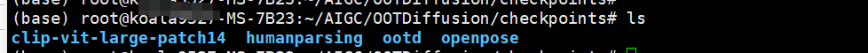
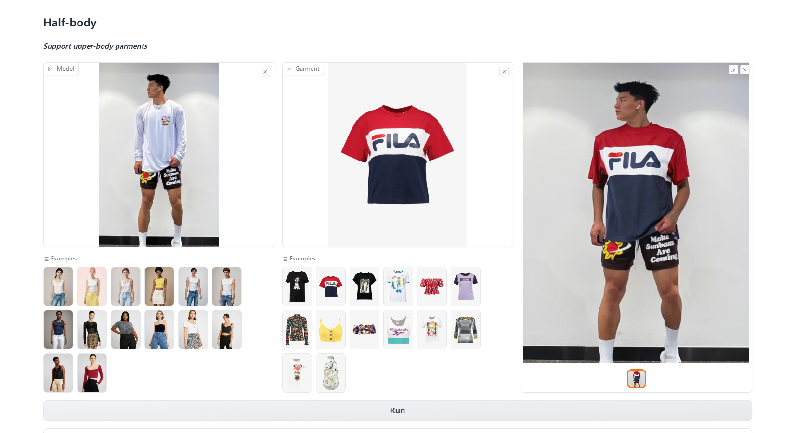

## 前言
最近休息了两天，连更1个月，准备转换一下思路，

## 部署
项目地址：https://github.com/levihsu/OOTDiffusion

没有中文的项目介绍

首先需要拉取项目的所有代码：
```shell
git clone https://github.com/levihsu/OOTDiffusion
```

基础环境搭建，我这里的显卡驱动已经安装好了， 这里的环境是Ubuntu,可以参考我之前的本地部署ChatGLM2的文章安装显卡环境

显卡相关的环境解决过后就需要使用conda 安装相关的依赖，现需要启动一个Python虚拟环境
```shell
conda create -n ootd python==3.10
conda activate ootd
pip install torch==2.0.1 torchvision==0.15.2 torchaudio==2.0.2
pip install -r requirements.txt
```

根据提示需要下载模型 ，模型下载地址有两个
```shell 
git lfs clone  https://huggingface.co/levihsu/OOTDiffusion
git lfs clone  https://huggingface.co/openai/clip-vit-large-patch14
```
下载完成后移动到主项目的 checkpoints 目录，模型非常大，需要耗费很长的时间，下载完成后效果如下：

接下来需要启动web 服务，不推荐使用官方的命令行。启动web服务需要修改一下run/gradio_ootd.py,需要注销掉3行代码,默认 gradio 会调用两个显卡

```python
# openpose_model_dc = OpenPose(1)
# parsing_model_dc = Parsing(1)
# ootd_model_dc = OOTDiffusionDC(1)
```
启动：
```shell
python run/gradio_ootd.py
```


本地访问:127.0.0.1:7865:
尝试一下

把淘宝的衣服下载下来尝试了一下，效果真不错哦



还可以调整，随机种子，重绘次数，一次生成的参数，但是目前仅仅生成上半身，上面注释的就是注释掉全身替换的代码，需要两块显卡同时运行。目前电脑只有一张显卡只能这样了

# 最后
如果感兴趣可以付费体验一下，限时三天，只须一元，如果需求大我可以考虑部署到云服务器上

感谢大家
