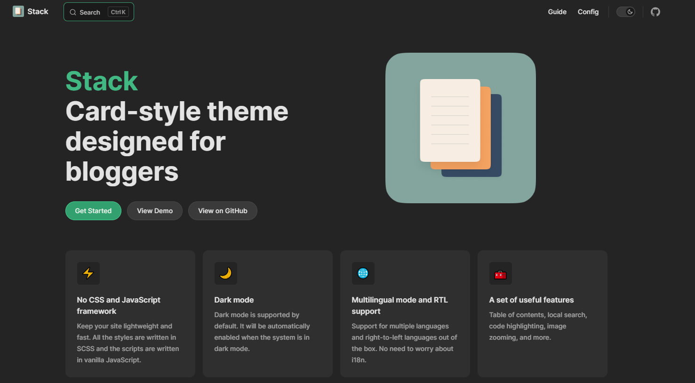
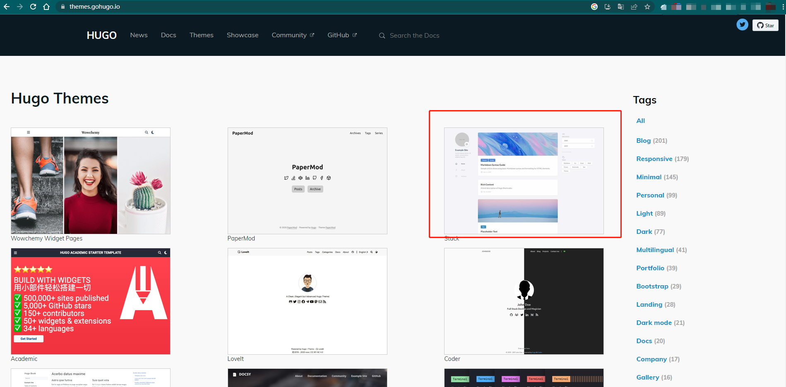
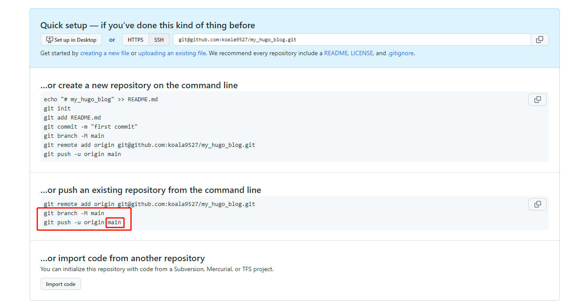

# 为什么要写博客
2022年结束，写了一篇年终报告，回顾发现记录总结是一个非常重要的事情，在接下来的时间需要把这件事养成一个习惯，不断记录，思考，积累 进步。

# 选择Hugo

Hugo 比较偏向后端，编译速度非常快，就这么简单。

# 简单记录一下过程
首要任务是选择一个简单好看的主题：[hugo-theme-stack](https://github.com/CaiJimmy/hugo-theme-stack)



这个主题最初是在V2EX 看到的，挺小清新的，符合现代审美。然后在Hugo的官方主题商店看到了它。




看起来主题的亮色模式有点太白了，有些文字看得不是很清楚，后面再想办法调整一下。

一开始看Hugo官方文档使用命令行新建一个Hugo项目再添加这个主题，因为有一些设置覆盖，一直没弄好，后面参考文档直接使用了这个主题的快速入门模板项目，
直接拉下来，调整配置直接运行起来了，目前使用项目自带的GitHub Action地配置搭配了一个二级域名部署在了GitHub Page上了。

接下来仔细说说自己做了那些事，改了哪些东西。因为没有参考任何的教程，查找地相关教程都比较笼统，没有针对这个主题的教程，所以下面的内容全都是自己折腾实验的。

## 改配置

快速启动模板的GitHub 地址：

[CaiJimmy/hugo-theme-stack-starter](https://github.com/CaiJimmy/hugo-theme-stack-starter)


```git clone https://github.com/CaiJimmy/hugo-theme-stack-starter```

先把代码拉下来，所有的配置文件都在/config/_default 文件夹内，配置文件有很多，自己修改了其中个别几个，下面详细讲讲。

### config.toml
博客的基本信息

标题，用户名，部署的域名，语言
```toml
baseurl = "https://blog.tuwei.space"
languageCode = "zh-Hans"
paginate = 5
title = "koala9527的博客"

DefaultContentLanguage = "zh-cn"

hasCJKLanguage = false

# Change it to your Disqus shortname before using
disqusShortname = "koala9527"
```

### menu.toml
博客菜单

删掉了Twitter联系方式，更改GitHub地址，没有什么拿得出手的，就留这个吧。
```toml
[[social]]
identifier = "github"
name = "GitHub"
url = "https://github.com/koala9527"

[social.params]
icon = "brand-github"
```
### params.toml
杂项，很多配置，没有仔细研究

我只改了两项，个性签名和头像。
```toml
[sidebar]
emoji = "🍥"
subtitle = "悟已往者不谏,知来者知可追"

[sidebar.avatar]
enabled = true
local = true
src = "img/avatar.jpg"
```
这里需要注意的是头像的文件位置，需要在项目根目录新建一个assets/img文件夹，把头像的图片文件放进去，官方文档是这么说的：


## 部署

先要在GitHub 新建一个公开的项目，我的自己项目地址：
[koala9527/my-hugo-blog](https://github.com/koala9527/my-hugo-blog)


此时需要注意推送的分支需要和快速启动模板内.github/deploy.yml文件的CI触发的分支一致。

我一开始没看见注意使用的是main这个名字，项目中的出发分支名称是master无法触发自动部署。




接着把本地修改的内容全部提交到刚刚新建的Github仓库，注意分支，Git仓库会触发Github Action自动新建一个gh-page的分支。

### 解析域名

点击项目的Settings->pages  

设置部署构建来源设置成来自分支  

分支名称为gh-pages  


然后再设置一个自定义域名


设置域名过后需要在域名DNS服务商设置DNS解析。

上面是是Git账号的域名解析，不确定是不是必须的，在账号设置下的page菜单中添加，添加过后会提示需要一个TXT类型域名解析用来 验证域名的所有权。


下面是项目的自定义域名解析，是一个二级域名，二级域名记录为blog，解析内容为koala9527.github.io ,记录类型为CNAME,koala9527为我自己的Github名称。

到此为止，整个博客的从零开始到上线部署就完成了。

# 写在最后
GitHub的访问貌似有一点慢，后面考虑部署到CDN上面吧，静态页面博客部署，访问，迁移非常地方便快速，这些优点就非常明显！

