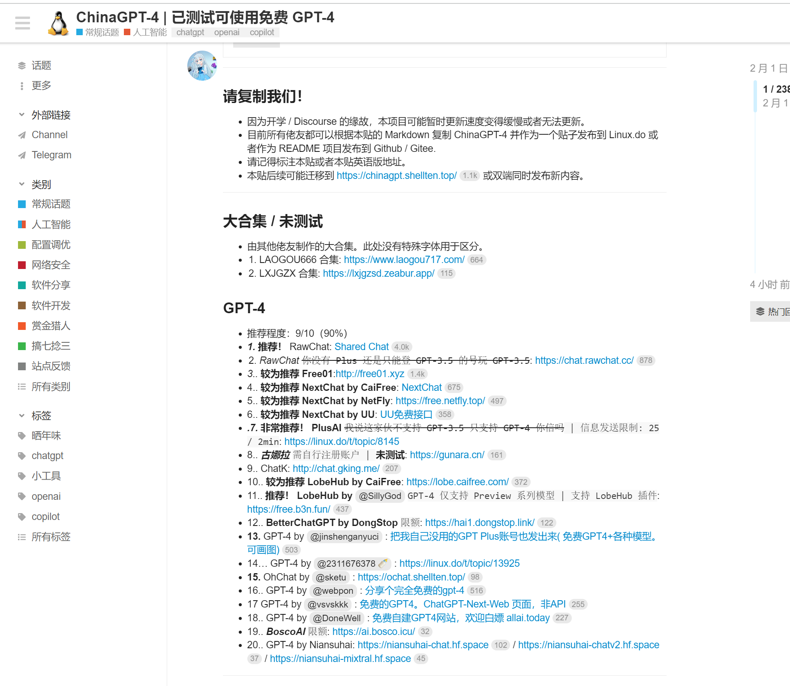

# 前言
前面几篇分享了一下怎么搭建私有的ChatGPT网页应用，后台收到了很多同学的私信，相信已经在使用了，今天继续分享我找到的公益ChatGPT4.0模型网页应用。

用了很久的ChatGPT3.5模型，作为日常工作我觉得已经够用了，我个人觉得比国内的文心一言、通义千问以及讯飞星火大模型都更好用。

个人觉得ChatGPT3.5比更强大的只有ChatGPT4.0了， ChatGPT4.0早在2023年3月15就推出来了，ChatGPT4.0 比ChatGPT3.5能更准确地理解用户输入，并生成更合理、连贯的回应，能够更好地理解上下文信息，准确捕捉用户的意图，因此产生的回答更符合语境，让用户能够更轻松地获取准确、有意义的信息。

我自己搭建的ChatGPT3.5私有ChatGPT网页应用已经分享给很多人使用了，好多人都在问我想要合租ChatGPT4，想体验最强的‘科技’。

目前常规手段使用ChatGPT4.0 就是通过OpenAI 官网进行付费订阅，但是对于普通来说价格来说价格还是挺贵的，

20美元一个月，按照当前美元的汇率，一个月需要140+元人民币，个人觉得辅助工作还是没必要充值的。那怎么最低成本用到这个ChatGPT4.0

# 分享
我发现了很多跟我一样ChatGPT3.5做免费站点的，我在想肯定也有人做ChatGPT4.0的免费站点的，最终花了一些时间发现在这个网站里面有很多分享：

https://linux.do/
首页 热门 菜单选项里面有很多介绍帖子

这个网站无需登录就可以访问帖子详情，我找到一个综合测评类型的帖子，找出来几个我自己常用比较稳定的网站 粘贴到这里（看到贴子升级到1级 就能看到一个精华神贴的类别，就会发现更多分享类似网站的帖子。）

https://sharedchat.cn/shared.html （热度最高，人比较多，访问比较慢，稳定性还行，高度模仿官网，可以上传图片，excel等资源）

http://free01.xyz/ (实时更新的分流站点，部署位置节点比较远，访问比较慢)
https://chat.gking.me （界面不怎么好看，使用人比较少，访问比较慢，需要自己切换4.0）

http://w10.xjai.cc （推荐，速度很快，默认就是 gpt4, 额度有限，可能会临时切回3.5）

区分ChatGPT是3.0还是4.0 最简单的方法就是 问它 “鲁迅和周树人是一个人吗？” ChatGPT4.0会说是。ChatGPT3.5会说不是。 还有一些弱智吧的问题，ChatGPT4.0 大多数就不会落入人类的“陷阱”。

# 最后
我分享的一些免费使用ChatGPT4.0免费站使用人数都比较大，可能都不怎么稳定。

写这篇文章的时候发现GitHub上面的 Coze Discord Proxy 这个项目可以利用 Coze 的机器人 API无成本搭建私有的ChatGPT4.0 网页应用，后面我想自己搭建，到时候我也会分享出来给大家使用 ，请继续关注我哦~。

往期热点：
《OpenAI Sora已开放对外申请，大家可以申请了。 》
《大模型这么火，今天手把手教大家从搭建环境开始实现本地部署ChatGLM2 6B 大模型》
《分享一下ChatGPT相关使用技巧 》
《如何搭建一个私人 ChatGPT 网页应用》