扣子（coze.cn） 国内版已经正式上线，过去了不到一个月的时间今天来用它尝试一下做一个AI机器人。

# 数据来源整理
当然是著名的V站了，找到了一个公开的爬虫项目，看到一些数据

https://github.com/oldshensheep/v2ex_scrapy

项目网站并下载releases:


下载解压：
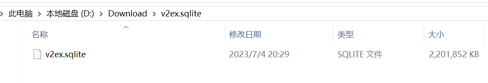

使用Navicate 链接查看一下（无密码）：
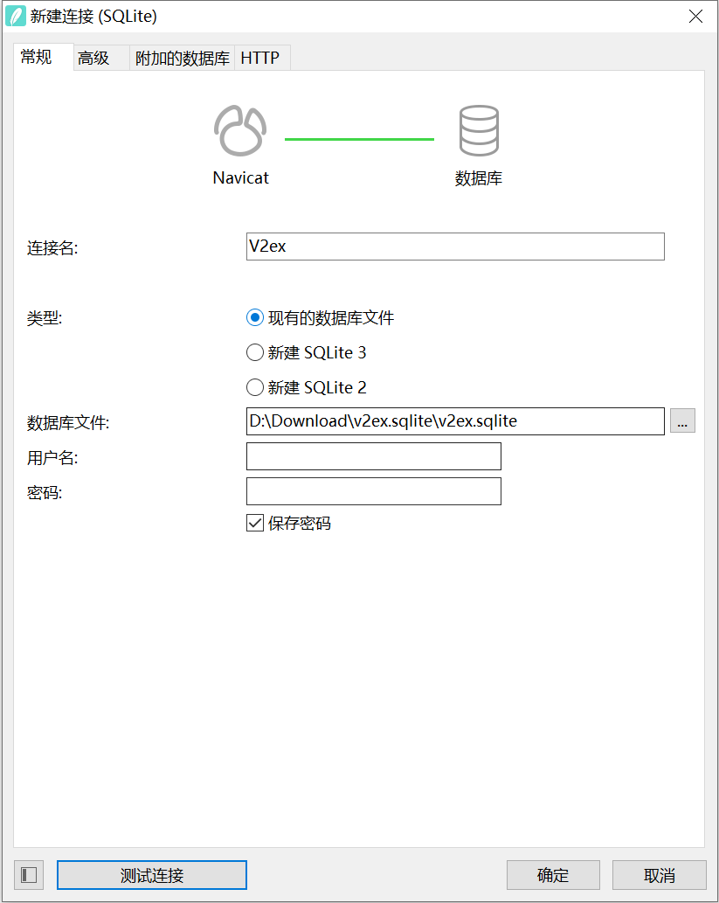

评论表才是重要的内容
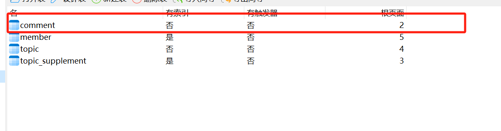

提前看了coze上传知识库的文件大小不能超过20M  
几番测试 需要筛选thank_count>4的内容导出的有17.4M，65193条记录


```sqlite
SELECT content FROM "main"."comment" WHERE "thank_count" > '4'
```

# coze操作

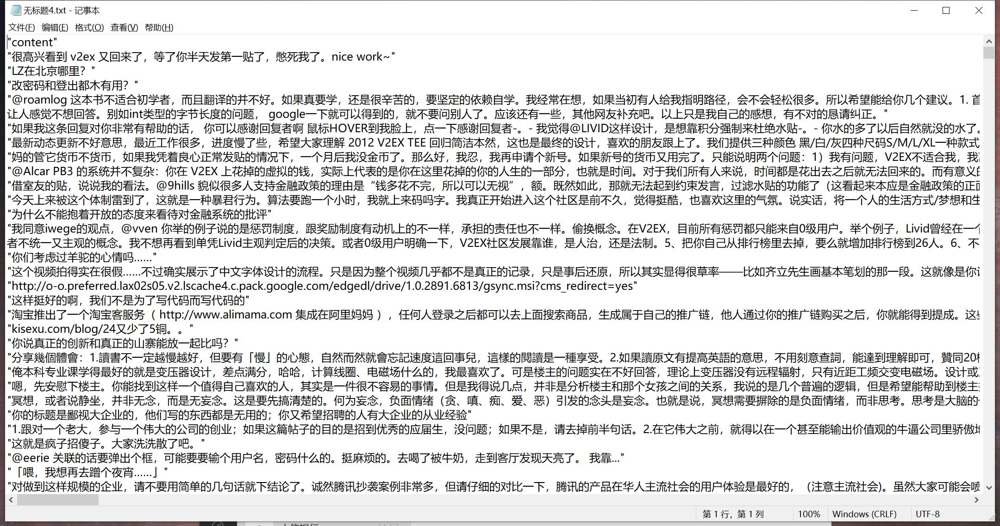
注册coze，创建Bot
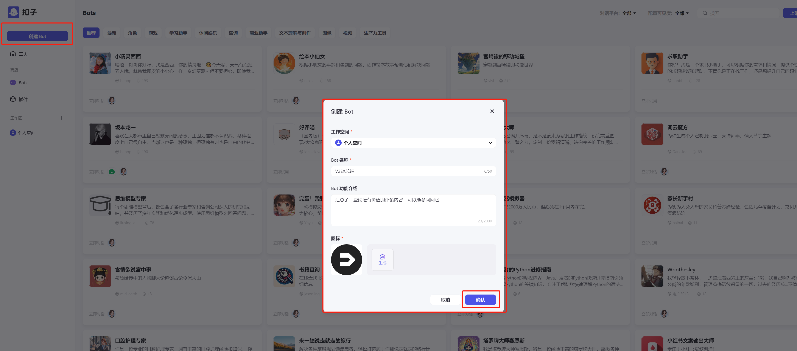

添加知识库
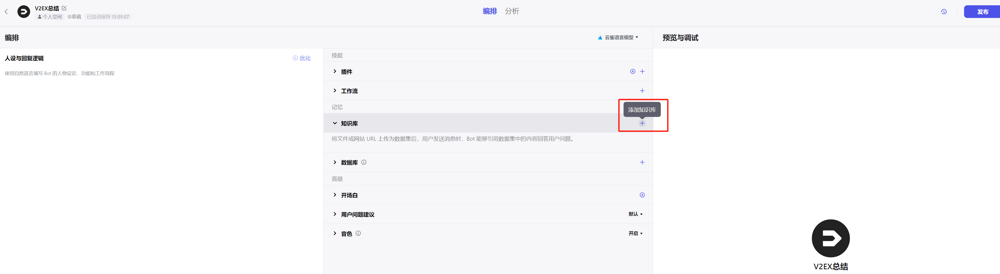

创建知识库


新增文档

（现在回头来看是可以上传10个文件的，每个文件不超过20m），先简单试一下吧
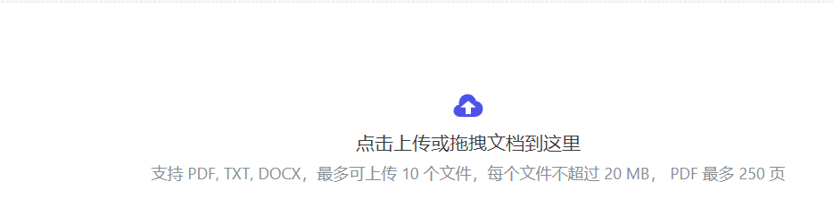
上传之后等待自动处理完毕
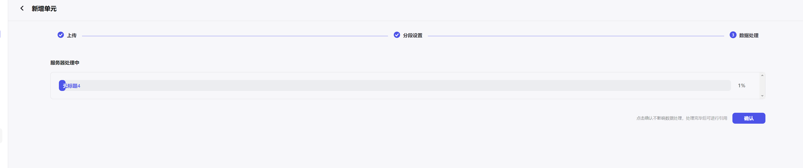

报错了，分段过多
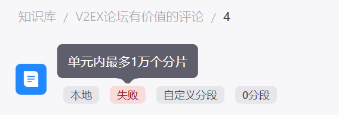
我才是一行一条数据有6w行，一个分段超过1w就不行，想了一下字符过短的语义可能分析不出来，查询的时候限制一下字符长度，thank_count调小一点，然后再分多个查询查询出多个文件看看
调整成10个查询条件如下：
```sqlite
SELECT content FROM "main"."comment" WHERE "thank_count" > '1' and LENGTH(content)>60 LIMIT 10000 OFFSET 0;
SELECT content FROM "main"."comment" WHERE "thank_count" > '1' and LENGTH(content)>60 LIMIT 10000 OFFSET 10000;
SELECT content FROM "main"."comment" WHERE "thank_count" > '1' and LENGTH(content)>60 LIMIT 10000 OFFSET 20000;
SELECT content FROM "main"."comment" WHERE "thank_count" > '1' and LENGTH(content)>60 LIMIT 10000 OFFSET 30000;
SELECT content FROM "main"."comment" WHERE "thank_count" > '1' and LENGTH(content)>60 LIMIT 10000 OFFSET 40000;
SELECT content FROM "main"."comment" WHERE "thank_count" > '1' and LENGTH(content)>60 LIMIT 10000 OFFSET 50000;
SELECT content FROM "main"."comment" WHERE "thank_count" > '1' and LENGTH(content)>60 LIMIT 10000 OFFSET 60000;
SELECT content FROM "main"."comment" WHERE "thank_count" > '1' and LENGTH(content)>60 LIMIT 10000 OFFSET 70000;
SELECT content FROM "main"."comment" WHERE "thank_count" > '1' and LENGTH(content)>60 LIMIT 10000 OFFSET 80000;
SELECT content FROM "main"."comment" WHERE "thank_count" > '1' and LENGTH(content)>60 LIMIT 10000 OFFSET 90000;

```
查询出的内容分成10分全部自动分段
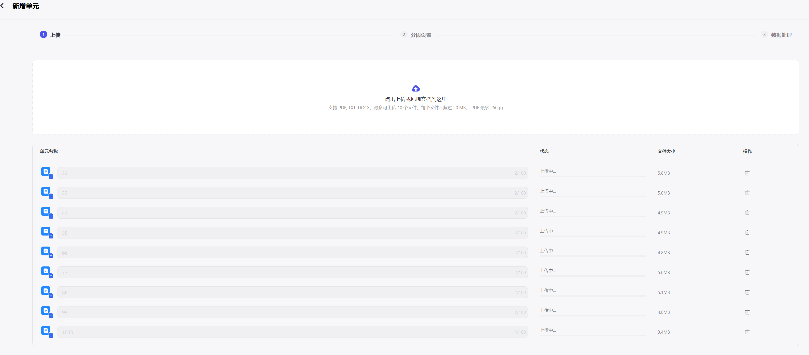
内部报错，尝试自动自定义分段
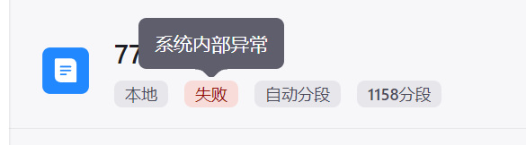
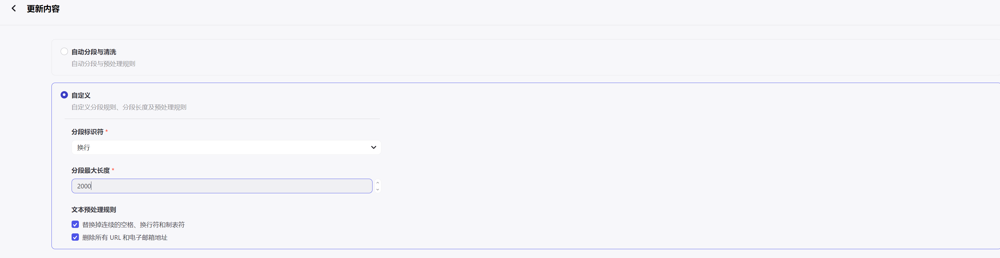
然后全部启用
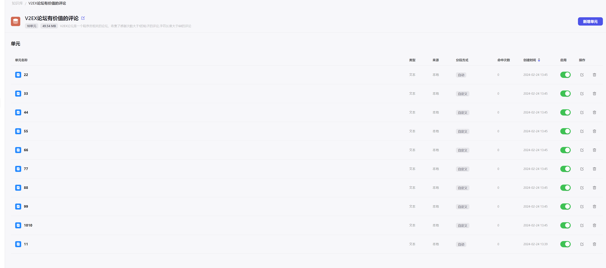

回到创建的机器人这里，点开机器人添加知识库
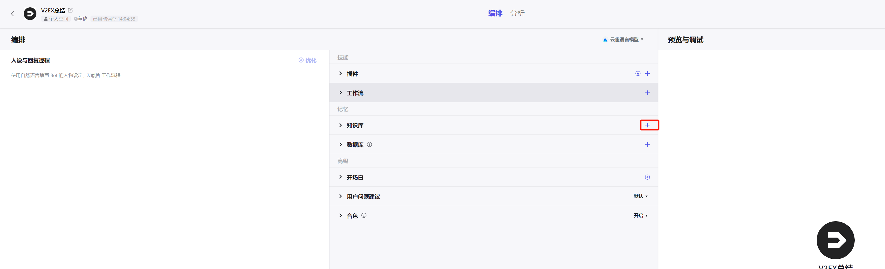


设置一下人设与回复逻辑：
```markdown
# 角色
你是一个功能强大的评论总结搜索助手，主要的功能就是根据知识库可以满足各种常见的问题。
```
最后发布

再次发布到商店
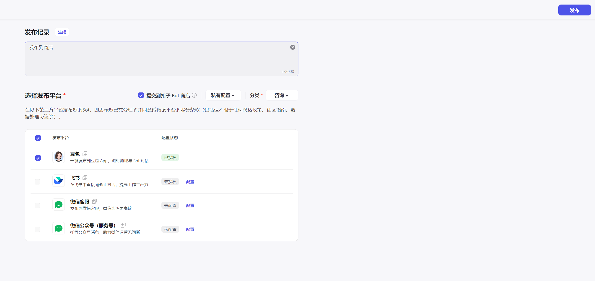

# 测试

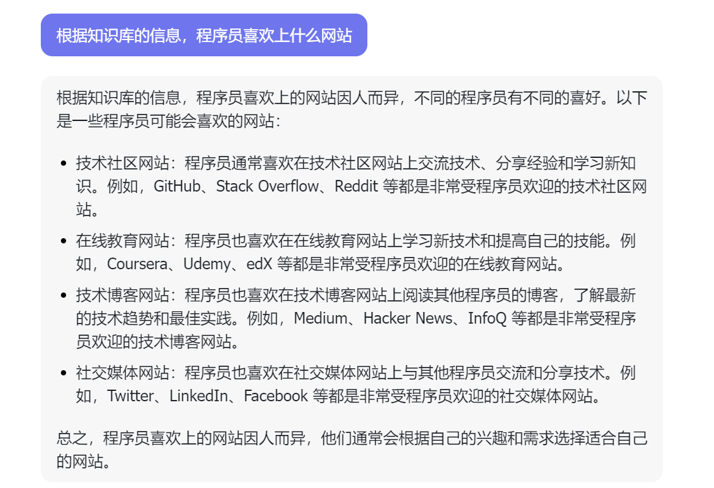
感觉效果不是很好，

尝试过导入到国外版的coze机器人里面，可以通过聊天可以直接问到一些详细具体的语料信息。

大家可以自己来试一下，或者有什么意见给到我呢？

BotID: 7339025335163387942

https://doubao.com/bot/rd0rttVE