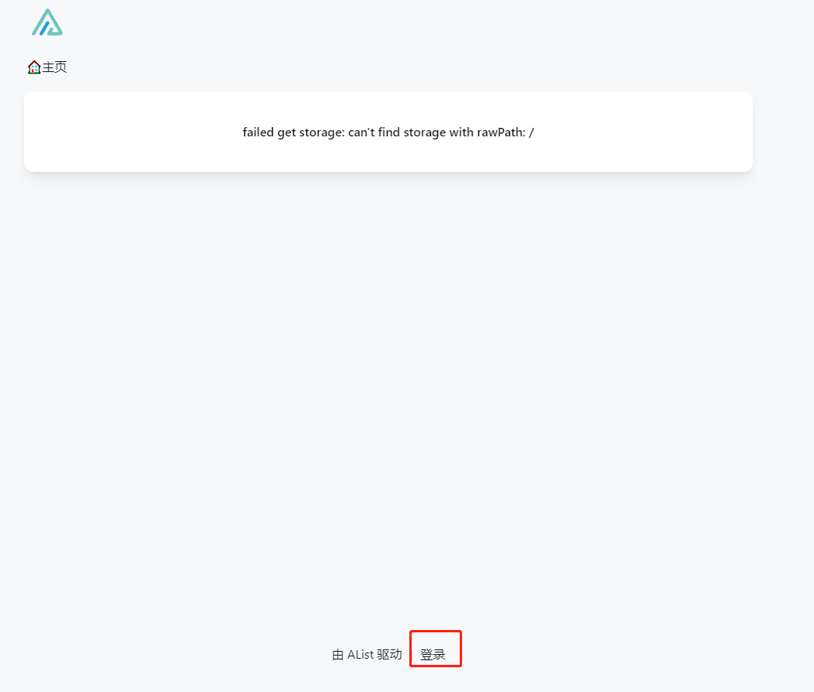
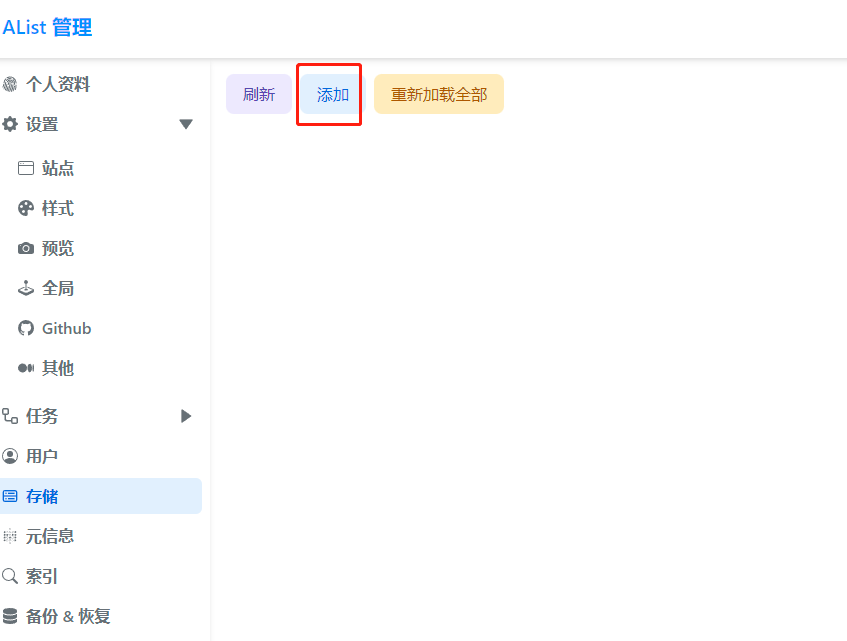
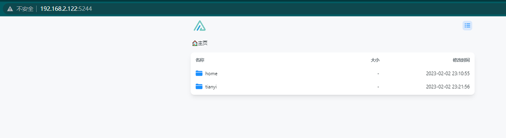
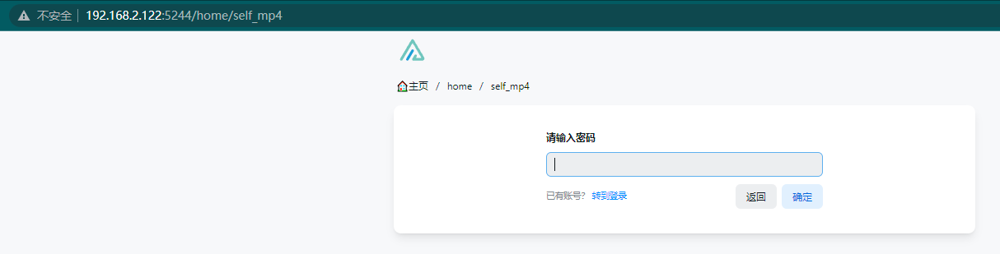

前篇文章记录了斐讯N1怎么安装frpc内网穿透，现在来继续折腾Alist插件,把本地存储和网盘集中到自己的搭建的Web服务中。

主要是看中了Alist颜值高和网盘挂载的功能。


# 使用Docker 安装 Alist
N1盒子已经自带了Docker软件，接下来直接使用Docker安装Alist，注意映射的本地目录。

我自己想让Alist管理的本地文件夹是N1盒子插的一块硬盘特定的文件夹  
文件目录为：/sharedfolders/N1/alist  
官方的教程是把容器里面的alist运行配置映射到宿主机（alist容器内的配置文件路径：/opt/alist/data）  
我再添加一个目录映射专门把宿主机的文件映射到Alist容器内部，让Alist管理  
```shell
docker run -d --restart=always -v /sharedfolders/N1/alist/config:/opt/alist/data -v /sharedfolders/N1/alist/data:/home -p 5244:5244 --name="alist" xhofe/alist:latest

```

然后在命令行运行`docker exec -it alist ./alist -password`查看初始密码：


访问内网地址`192.168.2.122:5244`进入alist的管理界面：



一进来就会提示没有挂载，此时不着急，点击下方登录，使用上面的密码登录，用户名是：`admin`

登录进入改下密码，然后设置储存：



添加本机存储：


挂载/home目录 ，根文件夹路径也是/home：


点击添加就可以了。再访问`192.168.2.122:5244`

就看到挂载的本机存储了：


到现在基础功能就实现了

# 尝试挂载网盘

挂载天翼云盘尝试一下，相对比较简单

在管理->储存->添加：


挂载路径就是在访问Alist的时候此时添加的储存的名字

用户名就是天翼云的账号也就是手机号。密码也就是天翼云盘的登录密码

根文件夹ID就是在访问web端的天翼云盘的文件夹ID, `-11`就是网盘的根目录：


# 最后效果&设置密码





接下来尝试可以给特定的文件夹添加密码

在 在管理->元信息->添加：


设置目录和密码就可以了，推出登陆后访问这个文件夹就会提示输入密码：



输入密码后还可以展示刚刚设置的文件夹说明：


后面我会把这这个Alist通过内网穿透使它能够在公网访问，然后尝试使用webdav挂载网盘到Windows，把网盘当作系统硬盘来使用


