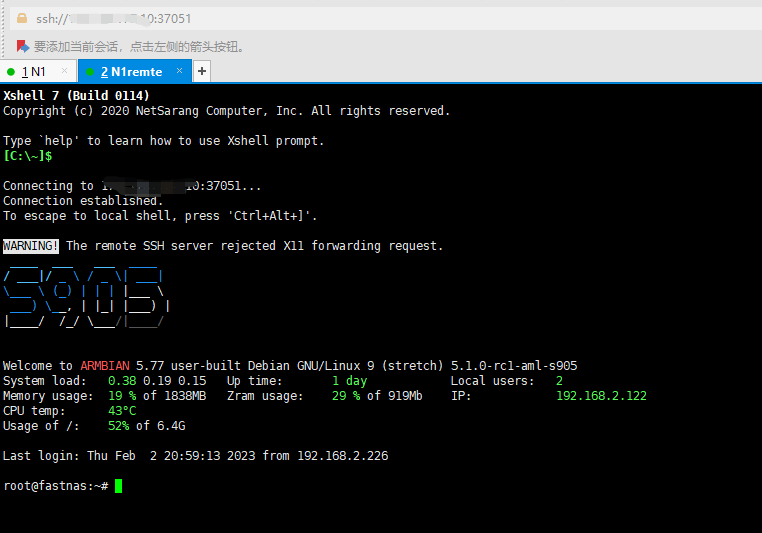

记录一次frp客户端安装

最近是把老路由器换下来了，之前的使用的是路由器挂硬盘当Nas，换了新路由器没有USB接口，把之前的电视盒子斐讯N1拿出来了，刷了一个FastNas系统
，但是没有Frp内网穿透功能，只有自己安装。

## 下载解压

frp项目地址：https://github.com/fatedier/frp
找到自己跟自己frp服务端匹配的版本 ，再确认N1的系统版本

下载对应的客户端：
```shell
wget https://github.com/fatedier/frp/releases/download/v0.34.2/frp_0.34.2_linux_arm64.tar.gz
```

解压tar.gz文件命令：
```shell
tar -zxvf frp_0.34.2_linux_arm64.tar.gz
```

cd 进入到解压后的文件夹找到客户端需要用的文件分别为：`frpc.ini` 和 `frpc`

首先编辑`frpc.ini`配置文件连接服务端
```ini
[common]
server_addr = ***.***.***.***
server_port = 7000
token = *****
[ssh]
type = tcp
local_ip = 127.0.0.1
local_port = 22
remote_port = 37051
```
连接服务端只需要3个配置 ，地址，端口，密钥

[ssh]是frp客户端需要穿透出去的服务
web服务是http服务的，基于tcp的可靠协议  
local_ip本地服务地址  
local_port本地服务的端口  
remote_port穿透映射到公网服务器的端口  

然后把`frpc.ini` 和 `frpc`两个文件移动到自己设置的位置，尽量不要放到解压出来的文件夹，不然过了一段时间就会忘记会把它误删掉。

我把它们分别移动到了/usr/local/frp/frpc 和 /etc/frp/frpc.ini位置

然后使用系统自带的  sytemctl 服务管理功能 启动frpc服务并且开机自启

找到 sytemctl 配置文件夹 /lib/systemd/system 新建 frpc.service 文件输入一下内容：
```ini
[Unit]
Description=frpc
Wants=network-online.target
After=network.target network-online.target
Requires=network-online.target
[Service]
ExecStart=/usr/local/frp/frpc -c /etc/frp/frpc.ini
ExecStop=/bin/kill $MAINPID
Restart=always
RestartSec=5
StartLimitInterval=0
[Install]
WantedBy=multi-user.target
```
然后执行`systemctl start frpc` 启动frpc服务
然后使用`systemctl status frpc`  查看服务状态:

最后执行`systemctl enable frpc` 设置开机自启

## 最后测试
使用公网IP，在frpc客户端配置的remote_port连接：



