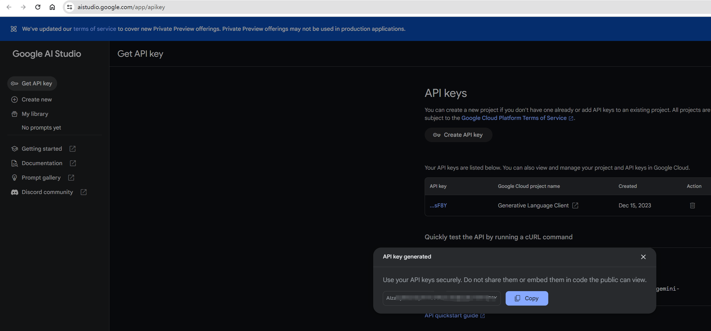
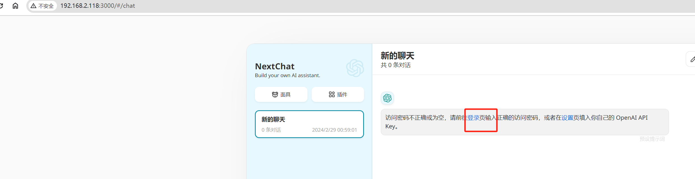
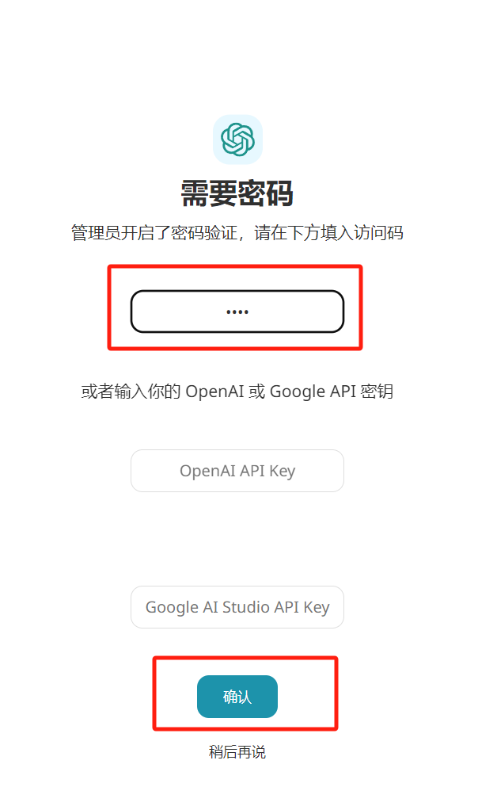
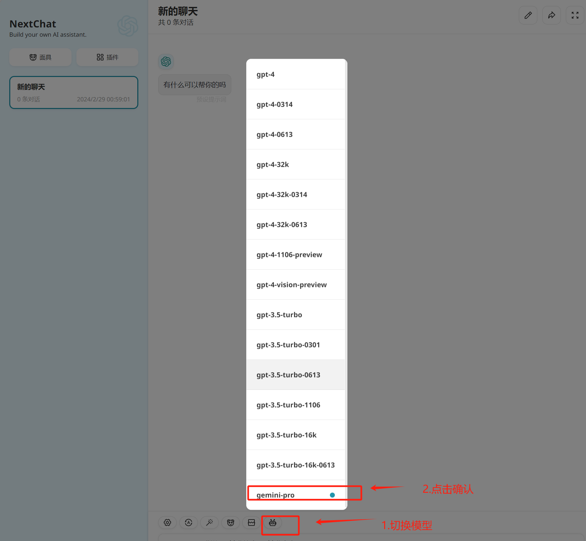
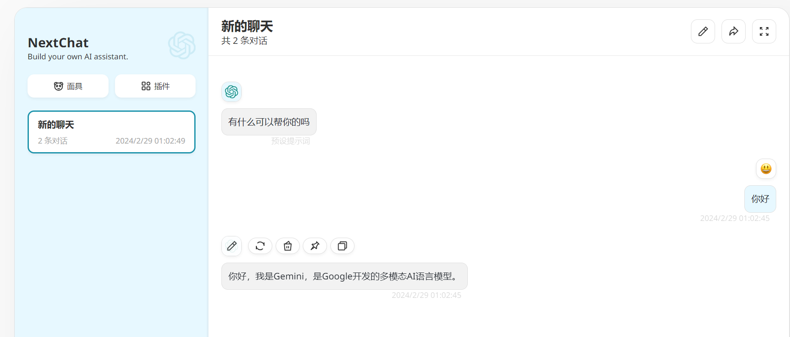

# 前言
Google 公司自己的大语言模型Bard 在2024年2月8号更名为 Gemini，但是Gemini 1.5 发布的时候被 OpenAI 的 Sora 抢尽了风头，堪称 AI 界的「汪峰」，听说Gemini有超长上下文的能力，支持 100 万token 的上下文，这里我还没测试，有兴趣的同学可以测试一下


关于Gemini我就不过多介绍了，还是希望有兴趣以及有能力访问的人亲自可以直接访问试试更好（注意Gemini和OpenAI有一样的网络限制）：   
https://gemini.google.com/
直接访问的使用的模型比API接口使用的模型更加聪明 还能理解图片，这可是需要付费的ChatGPT4的能力

附带Gemini的更新日志地址，详细的介绍了这个模型的特点：  
https://gemini.google.com/updates  

# 搭建
话不多说开始搭建
## 获取API Key
两个月前谷歌向所有用户都免费开放了Gemini PRO大模型的API，只要你有一个谷歌账号就可以免费获取Gemini Pro大模型的API， 获取Key地址：
https://aistudio.google.com/app/apikey


## 

私人 Gemini 网页应用采用 上篇文章说的 ChatGPT-Next-Web 这个项目，这个项目比搭建ChatGPT那个更复杂，需要增加一个.env文件

第一步找到 https://github.com/ChatGPTNextWeb/ChatGPT-Next-Web/ 这个项目下的docker-compose.yml 文件稍作，修改为一下内容：
```yaml
version: "3.9"
services:
  chatgpt-next-web:
    container_name: chatgpt-next-web
    image: yidadaa/chatgpt-next-web
    ports:
      - 3000:3000
    environment:
      - OPENAI_API_KEY=$OPENAI_API_KEY
      - GOOGLE_API_KEY=$GOOGLE_API_KEY
      - CODE=$CODE
      - BASE_URL=$BASE_URL
      - OPENAI_ORG_ID=$OPENAI_ORG_ID
      - HIDE_USER_API_KEY=$HIDE_USER_API_KEY
      - DISABLE_GPT4=$DISABLE_GPT4
      - ENABLE_BALANCE_QUERY=$ENABLE_BALANCE_QUERY
      - DISABLE_FAST_LINK=$DISABLE_FAST_LINK
      - OPENAI_SB=$OPENAI_SB
```
主要是做了一个精简，我这里不需要网络代理

然后在项目根目录下新建一个.env文件内容如下，也是参考ChatGPT-Next-Web 官方项目根目录下的.env.template文件：
```dotenv

# Your openai api key. (required)
OPENAI_API_KEY=

# Access passsword, separated by comma. (optional)
# 设置自己想要的密码，防止滥用
CODE=***

# You can start service behind a proxy
PROXY_URL=http://localhost:7890

# (optional)
# Default: Empty
# Googel Gemini Pro API key, set if you want to use Google Gemini Pro API.
# 需要填写自己的Key
GOOGLE_API_KEY=A************************F8Y 

# (optional)
# Default: https://generativelanguage.googleapis.com/
# Googel Gemini Pro API url without pathname, set if you want to customize Google Gemini Pro API url.
GOOGLE_URL=

# Override openai api request base url. (optional)
# Default: https://api.openai.com
# Examples: http://your-openai-proxy.com
BASE_URL=

# Specify OpenAI organization ID.(optional)
# Default: Empty
OPENAI_ORG_ID=

# (optional)
# Default: Empty
# If you do not want users to use GPT-4, set this value to 1.
DISABLE_GPT4=

# (optional)
# Default: Empty
# If you do not want users to input their own API key, set this value to 1.
HIDE_USER_API_KEY=

# (optional)
# Default: Empty
# If you do want users to query balance, set this value to 1.
ENABLE_BALANCE_QUERY=

# (optional)
# Default: Empty
# If you want to disable parse settings from url, set this value to 1.
DISABLE_FAST_LINK=

```

只需要修改两个地方，我用中文做了提示，现在就是docker-compose 命令启动就好：
```shell
docker-compose up -d
```
现在就可以在内网访问了,端口是3000，我这里的访问地址是：http://192.168.2.118:3000/

提示需要密码就是我在.env文件设置的密码：

点击确认过后还需要手动选择模型，因为我这里就只填了Gemini的API Key，没有填OpenAI的Key，所以现在只能使用一个模型：

现在就可以愉快地玩耍了：



# 对比&总结
1.Gemini的相应速度比ChatGPT的要慢一些
2.Gemini的知识正确程度要比ChatGPT3.5要强一些，比ChatGPT4要弱一些，Gemini能分得清楚周树人和鲁迅是一个人，ChatGPT3.5不行
3.Gemini的代码生成能力要比ChatGPT3.5要弱些，会使用大量的英文解释，而且没有注意边界条件，我试了一下让他们生成一个斐波那契数列的Python代码观测得出的结论。
个人观点仅供参考

最后我搭建的gemini的私有工具站点同样为了防止滥用也需要跟上篇文章一样回复关键字 gemini 来获得
上篇文章地址：《如何搭建一个私人 ChatGPT 网页应用》

感谢大家看到最后，下次想分享一下ChatGPT4的一些白嫖站点，相信大家肯定很感兴趣，希望大家多多点赞，给个再看分享给更多的人，这是我更新的动力。


