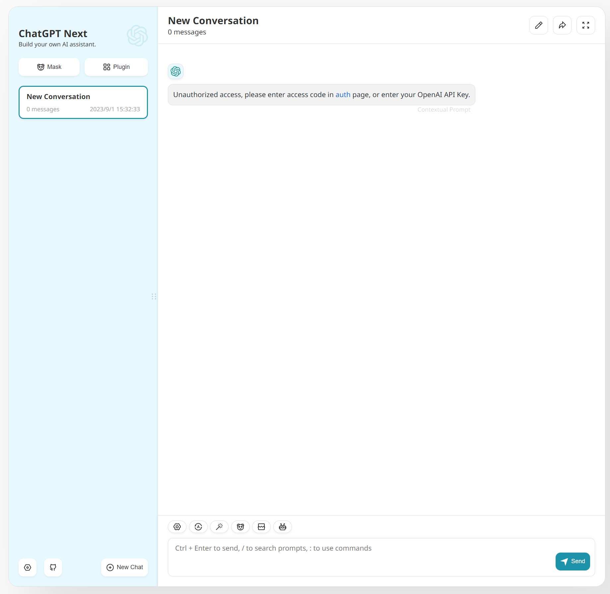
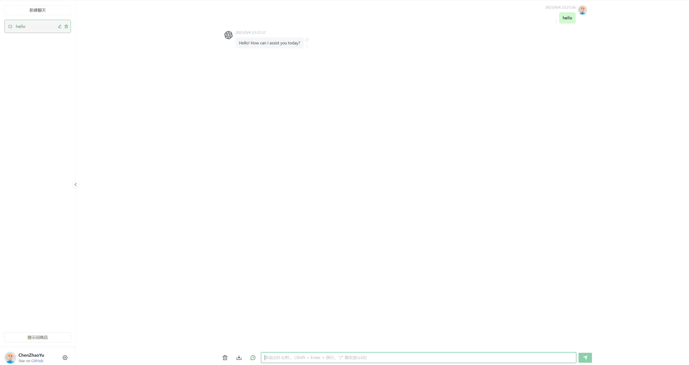

# 前言
ChatGPT 是目前最火热的生成式人工智能工具，由OpenAI公司研发发布，我现在每天都在用它

上篇文章讲了如何使用ChatGPT的使用技巧还给大家免费分享我自己搭建的ChatGPT网页应用《分享一下ChatGPT相关使用技巧》，有空的同学可以点击文章标题链接可以看一下。

今天就来简单分享一下怎么安装它的镜像站。

普通人可以直接使用我的搭建的私有ChatGPT网页应用，有兴趣的同学可以跟着我的教程来学着搭建一下。（有一定的门槛）

# 必要条件
* 拥有一个可以访问ChatGPT 官网的和GitHub的网络环境，ChatGPT 官网地址：https://openai.com/
* 购买一个ChatGPT的Key，推荐一个购买地址（0.6元人名币5刀余额的API KEY，不想买自己要用想办法用其他国家的手机号注册）：https://gpt888.shop/ (发卡网站不稳定有一定时效性)
* 一台可以使用Docker的机器，最好有个域名，可以公网访问更佳~

# 镜私有ChatGPT网页应用推荐
下面两个开源的私有ChatGPT网页应用自己都有实践搭建过，并且市面上大多数公开分享项目都来自于这两个项目。

1.https://github.com/Yidadaa/ChatGPT-Next-Web

前端比较好看，交互体验非常好，感觉体验比官网还好，而且自带提示词，自带prompt提示词仓库，点击就可以使用，功能比较强大，最新版已支持Google 的 Gemini AI机器人。

最早主分支在2023年3月7日首次提交，截止到目前24年2月28日为止已有62.3k star。

效果：


2.https://github.com/Chanzhaoyu/chatgpt-web

页面比较简单，实用，便捷快捷。自己一直在用，出的时候比较早。
最早主分支在2023年2月9日首次提，交截止到目前24年2月28日为止已有29.6k star。

效果：


# 搭建教程
搭建非常简单，知道会使用docker,使用docker-compose容器编排工具一键搭建，以第二个镜像站为例新建一个docker-compose.yaml文件：
```yaml
version: '3'

services:  
  app:
    container_name: chatgpt-web
    image: chenzhaoyu94/chatgpt-web # 总是使用latest,更新时重新pull该tag镜像即可
    restart: always
    ports:
      - 3002:3002
    environment:
      # 二选一
      OPENAI_API_KEY: sk-***************************  # 购买的key
      # 反向代理，可选
      #API_REVERSE_PROXY: https://gpt.pawan.krd/backend-api/conversation # 网络环境不支持访问OpenAI 的时候可以使用第三方的网络代理或者自建代理
      # 超时，单位毫秒，可选
      TIMEOUT_MS: 120000

```

然后执行命令：
```shell
docker-compose up -d 
```
命令执行完毕后服务器就会自动拉取`chenzhaoyu94/chatgpt-web`镜像，然后在本地启动一个服务，宿主机端口为3002
我这里是用内网机器部署的，内网访问：`http://192.168.2.129:3002`（第一次访问加载比较慢）:



可以直接访问了

# 搭建完毕

搭建非常简单，基础，主要难点在于网络环境的搭建，需要正常访问OpenAI，还有一个合理便宜的Key的购买渠道。然后后期怎么使用域名解析这个服务能随时随地访问。这里就不做详细介绍了，每个人的情况不一样。

我自己对这个chatgpt-web项目做了一点修改，需要提示验证码密码的时候我加了一个我自己的微信公共号二维码，替换了原项目中的Icon，然后更改了一下提示，提示需要回复关键字获取ChatGPT网页应用和密码，如果有需要可以私聊我，我会把修改过后的源码无偿提供给大家。

感谢大家看到这里，下篇会研究一下Google公司最近推出的Gemma模型 ，看看它跟ChatGPT有多大差别， 之前用过他们的borad，这个也是跟ChatGPT一样，现在已经开发免费使用，效果也非常不错，只是没有ChatGPT名气大。

OpenAI 公司的视频生成大模型Sora现在已开放对外申请，感兴趣也可以访问我的历史文章git：《OpenAI Sora已开放对外申请，大家可以申请了。》申请一下


