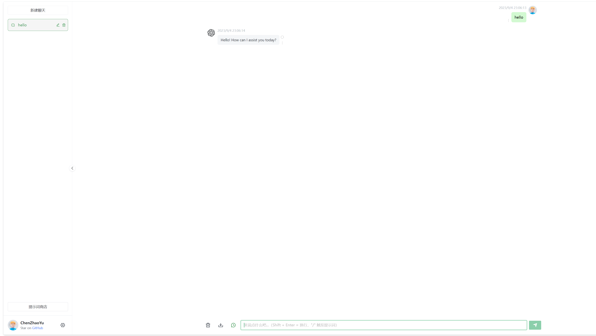

# 前言
ChatGPT 是目前最火热的生成式人工智能工具，由OpenAI公司研发发布，我现在每天都在用它。今天来记录一下怎么安装它的镜像站。

# 必要条件
* 拥有一个可以访问ChatGPT 官网的网络环境，ChatGPT 官网地址：https://openai.com/
* 购买一个ChatGPT的Key，推荐一个购买地址（2块钱左右5刀余额，不想买自己要用想办法用其他国家的手机号注册）：https://faka.aisvip.top/
* 一台可以使用Docker的机器，最好有个域名，可以公网访问更佳~


# 镜像站推荐：
自己都实践搭建过：

1.https://github.com/Yidadaa/ChatGPT-Next-Web

前端比较好看，交互也非常的有感觉，跟官网差不多。  最早主分支在2023年3月7日首次提交

效果：


2.https://github.com/Chanzhaoyu/chatgpt-web

页面比较简单，实用，自己一直在用，出的时候比较早，最早主分支在2023年2月9日首次提交

效果：


# 搭建
搭建非常简单，使用docker-compose 一键搭建，以第二个镜像站为例编写一个docker-compose.yaml文件：
```yaml
version: '3'

services:  
  app:
    container_name: chatgpt-web
    image: chenzhaoyu94/chatgpt-web # 总是使用latest,更新时重新pull该tag镜像即可
    restart: always
    ports:
      - 3002:3002
    environment:
      # 二选一
      OPENAI_API_KEY: sk-***************************  # 购买的key
      # 反向代理，可选
      #API_REVERSE_PROXY: https://gpt.pawan.krd/backend-api/conversation # 网络环境不支持访问OpenAI 的时候可以使用第三方的网络代理或者自建代理
      # 超时，单位毫秒，可选
      TIMEOUT_MS: 120000

```

然后执行命令：
```shell
docker-compose up -d 
```
命令执行完毕后服务器就会自动拉取`chenzhaoyu94/chatgpt-web`镜像，然后在本地启动一个服务，宿主机端口为3002
我这里是用内网机器部署的，内网访问：`http://192.168.2.129:3002`:


可以直接访问了

# 搭建完毕

搭建非常简单，基础，主要难点在于网络环境的搭建，需要正常访问OpenAI，还有一个合理便宜的Key的购买渠道。然后后期怎么使用域名解析这个服务能随时随地访问。这里就不做详细介绍了，每个人的情况不一样。That's it