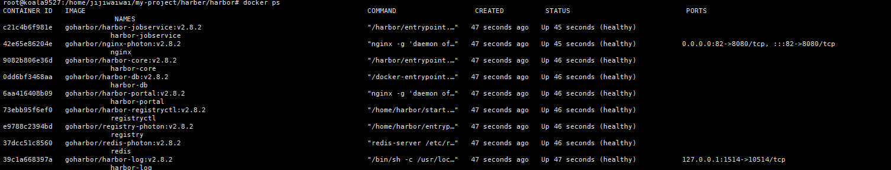
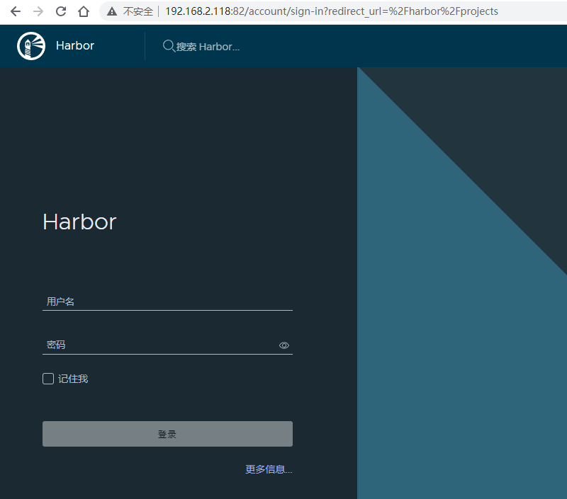
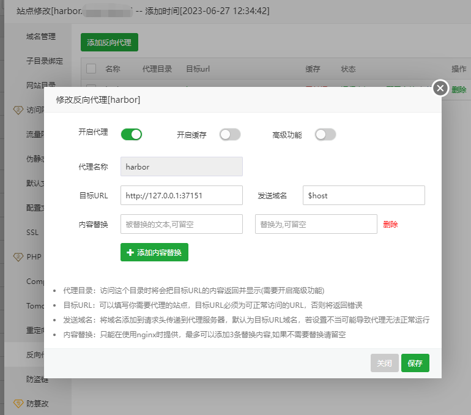
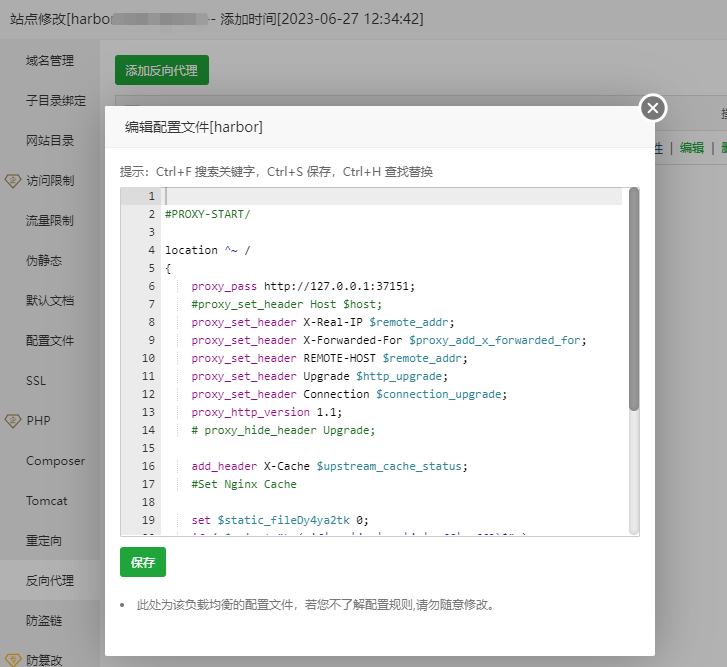
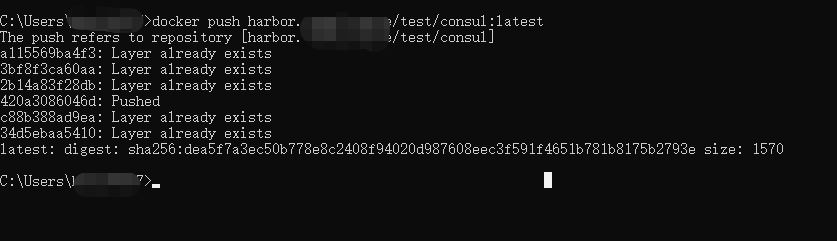
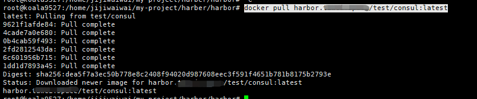

## 前言
一直在用阿里云的免费的容器镜像服务来存放自己打包好的容器镜像，虽然很好用，但是总觉得这些大厂免费得服务最后总是要收费，想搭建一个自己得私有镜像仓库。

自己以前搭建过 nexus 仓库，但是使用的很少，感觉跟jenkins 一样，用java写的，界面很古老，不是专业的docker镜像仓库。

前段时间把自己的树莓派都卖了，入手了一个N5101，今天在这个机器上安装 大名鼎鼎的开源的企业级镜像仓库Harbor。

## Harbor 简介
Harbor英文单词意思是港湾，港湾一般是停放货物，就会联想到集装箱（container）, 码头工人（Docker）。

容器（container）是Docker镜像的运行实例 ，Docker 是一个让 Container 标准话的方案 /工具。

Harbor 是一个专业的存储Docker镜像的企业级服务软件。Harbor是由VMware公司开源的企业级的Docker Registry管理项目，有非常丰富专业的功能，例如：
多租户内容签名和验证，安全性与漏洞分析，审计日志记录，身份集成和基于角色的访问控制，镜像复制分发，自动清理，Webhook等等。


## 安装
Harbor安装也非常得简单，自己是因为在内网部署的，有一些关于内网穿透的配置，可能和大部分的人的安装流程可能有些差别

### 下载离线安装脚本配置文件
访问官方GitHub地址：https://github.com/goharbor/harbor
找到并下载下载最新的发行版本：

我选择的是离线安装版本，自己的系统ubuntu，找一个专门存放Harbor的配置安装脚本的文件夹再新建两个文件夹，一个存放安装的映射的数据，一个存放配置安装文件:

```shell
mkdir data
mkdir harbor
```
然后下载解压安装包：
```shell
wget https://github.com/goharbor/harbor/releases/download/v2.8.2/harbor-online-installer-v2.8.2.tgz
tar zxvf harbor-online-installer-v2.8.2.tgz ./habor/
```
初始化配置文件
```shell
cp harbor.yml.tmpl  harbor.yml
```

### 修改配置文件：
重点来，一共需要修改6个地方
修改配置文件
```shell
vim  harbor.yml
```

```toml
# Configuration file of Harbor

# The IP address or hostname to access admin UI and registry service.
# DO NOT use localhost or 127.0.0.1, because Harbor needs to be accessed by external clients.
# 修改第一处 不重要，下面external_url设置的会覆盖这里
hostname: harbor.****.****

# http related config
http:
  # port for http, default is 80. If https enabled, this port will redirect to https port
  # 修改第二处 ，服务暴露穿透的端口，和现有服务冲突了，我就随便修了一个 
  port: 82

# https related config
# 修改第三处 ，关闭自带SSL的 服务
#https:
  # https port for harbor, default is 443
  #  port: 443
  # The path of cert and key files for nginx
  #  certificate: /your/certificate/path
  #  private_key: /your/private/key/path

# # Uncomment following will enable tls communication between all harbor components
#internal_tls:
#   # set enabled to true means internal tls is enabled
#   enabled: false
#   # put your cert and key files on dir
#   dir: /etc/harbor/tls/internal

# Uncomment external_url if you want to enable external proxy
# And when it enabled the hostname will no longer used
# 修改第四处 ，非常重要。运行起来之后拉去镜像的地址都是使用这个地址。可以用HTTPS，在穿透之后，最外层的入口必须使用HTTPS服务
external_url: https://harbor.****.****

# The initial password of Harbor admin
# It only works in first time to install harbor
# Remember Change the admin password from UI after launching Harbor.
# 修改第五处 设置运行起来后的默认密码，因为服务会暴露在公网，所有安全非常重要 
harbor_admin_password: *********

# Harbor DB configuration
database:
  # The password for the root user of Harbor DB. Change this before any production use.
  password: root123
  # The maximum number of connections in the idle connection pool. If it <=0, no idle connections are retained.
  max_idle_conns: 100
  # The maximum number of open connections to the database. If it <= 0, then there is no limit on the number of open connections.
  # Note: the default number of connections is 1024 for postgres of harbor.
  max_open_conns: 900
  # The maximum amount of time a connection may be reused. Expired connections may be closed lazily before reuse. If it <= 0, connections are not closed due to a connection's age.
  # The value is a duration string. A duration string is a possibly signed sequence of decimal numbers, each with optional fraction and a unit suffix, such as "300ms", "-1.5h" or "2h45m". Valid time units are "ns", "us" (or "µs"), "ms", "s", "m", "h".
  conn_max_lifetime: 5m
  # The maximum amount of time a connection may be idle. Expired connections may be closed lazily before reuse. If it <= 0, connections are not closed due to a connection's idle time.
  # The value is a duration string. A duration string is a possibly signed sequence of decimal numbers, each with optional fraction and a unit suffix, such as "300ms", "-1.5h" or "2h45m". Valid time units are "ns", "us" (or "µs"), "ms", "s", "m", "h".
  conn_max_idle_time: 0

# The default data volume
# 修改第六处，harbor 数据存放的地方，需要一个空余空间很大的文件夹，自行决定 
data_volume: /***/****

...
```
### 安装完成后的配置

运行在解压的目录下的install.sh脚本
```shell
./install.sh
```


会启动9个容器

此时内网访问已经可以了：



配置内网穿透frp，这里frp 的安装自己也在掘金也有介绍，这里就略过了
在frpc.ini 新加一个配置：
```shell
[n5105-harbor]
type = tcp
local_port = 82
local_ip = 127.0.0.1
remote_port = 37151

```
重启frp

然后在外网的机器上，新建一个域名解析：harbor.****.**** ,反向代理到这个frp的远程端口`remote_port`:


然后再修改一个反向代理配置才能推送镜像成功,注释掉`proxy_set_header Host $host;`：

 proxy_set_header作用是用于设置传递给后端服务器的HTTP头信息，可能因为harbor 自身没有启动SSL的支持，但是有反向代理的带有SSL的支持会有问题，如果注释掉这个反向代理的Nginx 配置推送镜像会报错`unknown blob`


## 结束
验证最基础的推拉镜像是否正常
最先需要用账号（admin）和密码在命令行登录获得这个私有镜像仓库的推送权限：  


然后使用设置的密码登录harbor，新建一个公开项目：  


进入项目，找到推送命令，然后在本地找一个简单镜像重新打包  


自己找了一个本地的consul镜像，重新打tag ，推送镜像，命令如下：  
```shell
docker tag  consul:latest harbor.****.****/test/consul:latest
docker push harbor.tuwei.space/test/consul:latest
```
推送成功：


然后在其他的机器上直接执行拉取命令：
```shell
docker pull harbor.****.****/test/consul:latest
```

到此完结，最简单的安装验证，Harbor 还是比较占用系统资源的，现在小主机很火，很多人都在弄ALL IN ONE，HomeLab。使用内网穿透部署这种镜像管理的工具性价比还是比较高的。
