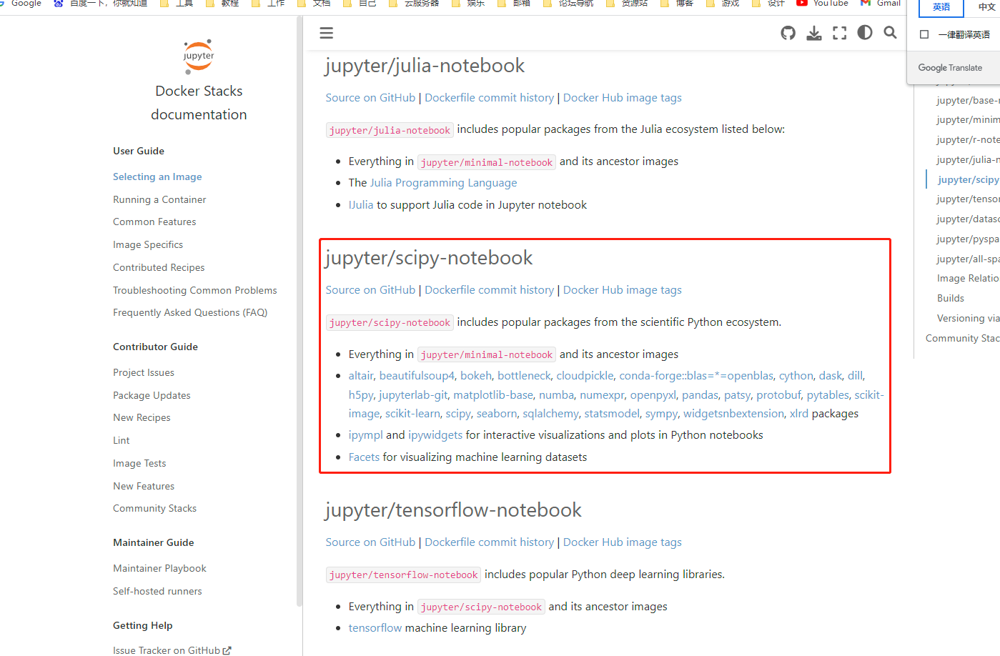
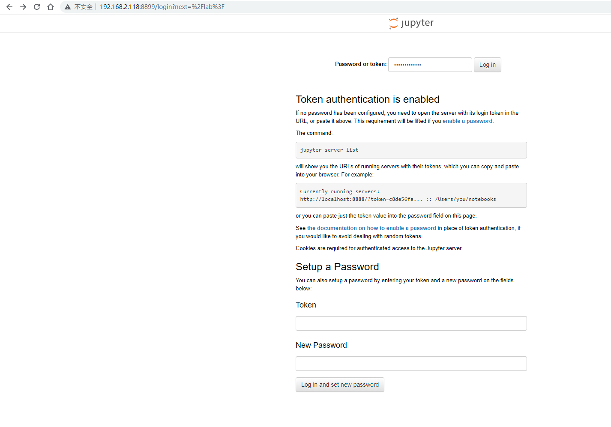
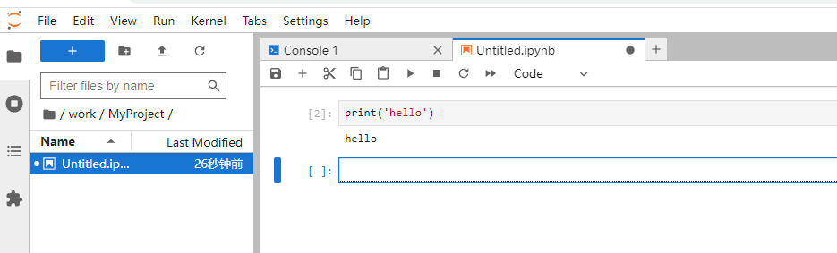

查看哪些docker镜像：
```shell
root@koala9527:/home/jijiwaiwai/my-project/jupyter-notebook# sudo docker search jupyter
NAME                                 DESCRIPTION                                      STARS     OFFICIAL   AUTOMATED
jupyter/scipy-notebook               Scientific Jupyter Notebook Python Stack fro…   406                  
jupyter/tensorflow-notebook          Scientific Jupyter Notebook Python Stack w/ …   345                  
jupyter/all-spark-notebook           Python, Scala, R and Spark Jupyter Notebook …   417                  
jupyter/pyspark-notebook             Python and Spark Jupyter Notebook Stack from…   277                  
jupyter/datascience-notebook         Data Science Jupyter Notebook Python Stack f…   1027                 
jupyterhub/singleuser                single-user docker images for use with Jupyt…   45                   [OK]
jupyterhub/jupyterhub                JupyterHub: multi-user Jupyter notebook serv…   326                  [OK]
jupyter/minimal-notebook             Minimal Jupyter Notebook Python Stack from h…   183                  
jupyter/base-notebook                Base image for Jupyter Notebook stacks from …   203                  
jupyterhub/k8s-hub                                                                    22                   
jupyterhub/k8s-network-tools                                                          2                    
jupyterhub/configurable-http-proxy   node-http-proxy + REST API                       6                    [OK]
jupyterhub/k8s-singleuser-sample                                                      10                   
jupyter/nbviewer                     Jupyter Notebook Viewer                          32                   [OK]
jupyter/r-notebook                   R Jupyter Notebook Stack from https://github…   54                   
jupyterhub/k8s-image-awaiter                                                          2                    
jupyter/repo2docker                  Turn git repositories into Jupyter enabled D…   21                   
jupyterhub/k8s-secret-sync                                                            1                    
jupyterhub/jupyterhub-onbuild        onbuild version of JupyterHub images             6                    
bitnami/jupyter-base-notebook                                                         39                   
jupyter/demo                         (DEPRECATED) Demo of the IPython/Jupyter Not…   16                   
jupyterhub/k8s-image-cleaner                                                          1                    
jupyterhub/k8s-binderhub                                                              3                    
jupyterhub/k8s-pre-puller                                                             1    
```
参考官网： https://jupyter-docker-stacks.readthedocs.io/en/latest/using/common.html 可以看到各个镜像的简要介绍

我选择了第一个： 包含来自科研科学类的Python生态系统的热门软件包


编写docker-compose.yml.后期维护有记录：
```yml
version: "3.3"

services:

  scipy-notebook:
    image: jupyter/scipy-notebook:latest
    container_name: jupyter-notebook
    tty: True
    user: root
    restart: always
    ports:
      - 8899:8888
    volumes:
      -  ${PWD}/.aws:/home/jovyan/.aws
      -  ${PWD}/work:/home/jovyan/work
    environment:
      - REPOS=/home/jovyan/work/git
      - JUPYTER_TOKEN=********
      - JUPYTER_ENABLE_LAB=yes
      - NB_UID=1000 #$(id -u)
      - NB_GID=1000 #(id -g)
```
注意要 UID  NB_GID 需要设置一下，属于linux 的用户组管理，会影响 Jupyter 服务器进程以及在容器内创建或挂载文件时的权限和所有权。  
我这里设置的我安装系统后创建的第一个用户，通过`id`查看，不建议用root 用户，貌似会启动不起来。  
如果不设置就会报错：


启动命令：
```shell
docker-compose -d
```
容器运行起来后宿主机的 `${PWD}/work` 目录需要设置用户权限，我的这个目录是root 用户权限创建的其他用户不用进行创建文件的操作，需要使用`chmod 777` 是其他用户组有读写权限：
```shell
root@koala9527:/home/*****/my-project/jupyter-notebook# ls -l
总计 8
-rw-r--r-- 1 root root  471  7月  2 16:06 docker-compose.yml
drwxr-xr-x 2 root root 4096  7月  2 15:25 work
root@koala9527:/home/*****/my-project/jupyter-notebook# chmod 777 work/
root@koala9527:/home/*****/my-project/jupyter-notebook# ls -l
总计 8
-rw-r--r-- 1 root root  471  7月  2 16:06 docker-compose.yml
drwxrwxrwx 2 root root 4096  7月  2 15:25 work


```


通过内网访问:


## 验证使用：
新建一个Notebook项目尝试运行：

