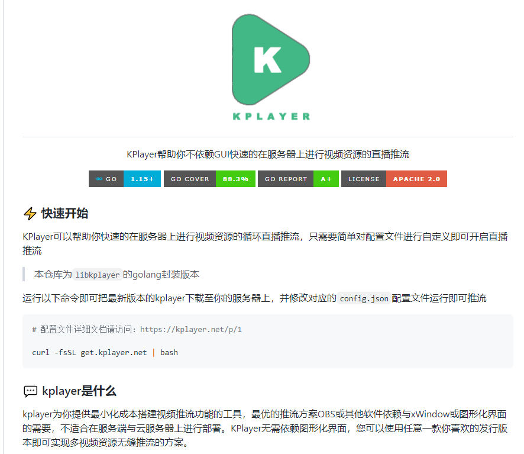
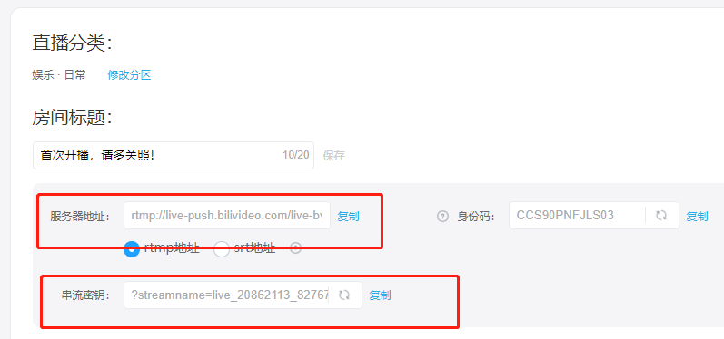

## 前言
看到张大妈网站有一个非常火的文章，分享如何使用docker 部署一个24小时直播推流的服务薅羊毛，正好有闲置的服务器，然后每天收益大概有1元钱，于是就想试一下。

## 项目介绍
项目地址：[bytelang/kplayer-go](https://github.com/bytelang/kplayer-go)   

项目介绍看图


## 部署
第一步准备docker 镜像
```shell
docker pull bytelang/kplayer:latest
```
## 准备配置文件路径映射
准备工作，准备三个文件/文件夹映射  
1.配置文件映射  
2.播放资源的文件夹映射  
3.缓存目录的映射  

我的服务器是Linux Centos系统，服务器叫宿主机。  
宿主机文件地址是需要自己自定义的  
* 宿主机播放资源文件地址(放了一些抖音视频)：/home/***/mp4
* 宿主机配置文件（稍后再说）：/home/***/kplayer/config.json
* 宿主机直播编码缓存文件地址 ：/home/***/kplayer/cache

容器映射的文件目录是固定的   
宿主机播放资源文件地址是根据config.json内容配置文件来定义的
* 容器播放资源文件地址：/video
* 宿主机配置文件（必须固定的地址）：/kplayer/config.json
* 容器播放资源文件地址（必须固定的地址）：/kplayer/cache

## 获取BiliBili 直播推流地址
1.首页直播：


2.网页右侧开播设置： 


3.选择分类，点击开播，前提是需要身份证和姓名实名认证：


4.得到直播推流地址：



`服务器地址` 拼接上 `串流密钥`   就是推流的地址：
`rtmp://live-push.bilivideo.com/live-bvc/?streamname=live_******_******&key=**************&schedule=rtmp&pflag=1`
## config.json配置文件内容
在宿主机/home/***/kplayer/config.json内容如下（把上面获取的推流地址替换到下面的配置文件中） ：
```
{
    "version": "2.0.0",
    "resource": {
        "lists": [
            "/video/"
        ],
        "extensions": ["mp4"]
    },
    "output": {
        "lists": [
            {
                "path": "rtmp://live-push.bilivideo.com/live-bvc/?streamname=live_******_******&key=**************&schedule=rtmp&pflag=1"
            }
        ],
	"reconnect_internal": 5
    },
    "play": {
     "fill_strategy": "ratio",
     "skip_invalid_resource": true,
     "cache_on": true,
     "play_model": "random",
    }
}

```
注意 `['resource']['lists']` 的配置内容就是 容器内的播放资源文件地址   

`"cache_on":true` 就是启用推流编码缓存，会生成缓存，命中缓存节约CPU资源  

`"play_model": "random"` 就是在播放列表中随机播放

## 启动运行

使用docker 运行容器 加上上面的文件目录映射就可以了：
```shell
docker run  -td --name=kplayer -v /home/***/mp4:/video -v  /home/***/kplayer/config.json:/kplayer/config.json -v /home/***/kplayer/cache:/kplayer/cache  --restart=always  bytelang/kplayer:latest  
```
使用`docker logs kplayer`查看日志，看到下面的日志就表示成功了：

访问直播地址也正常直播了。


