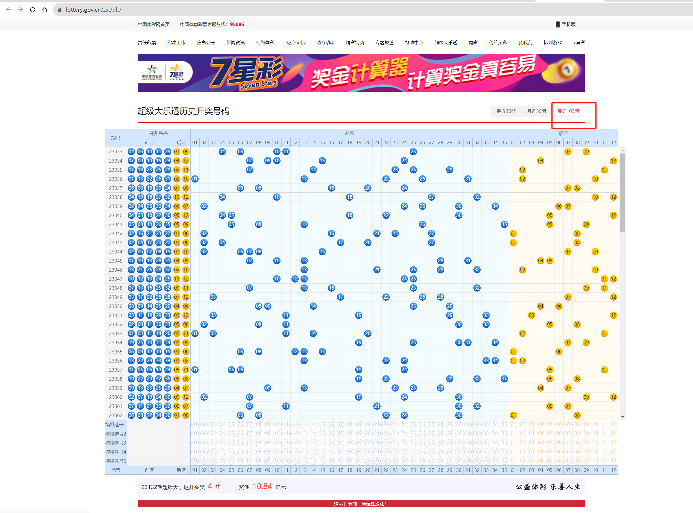
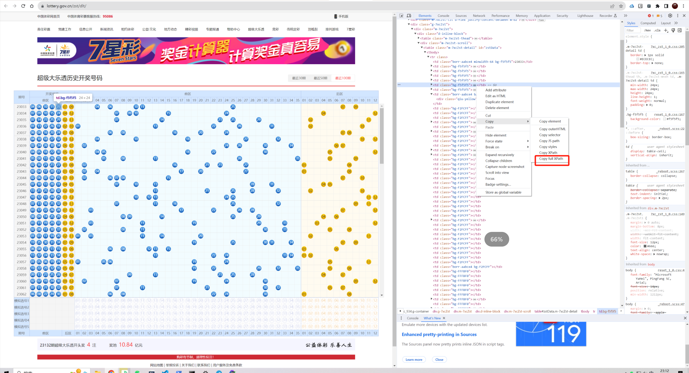
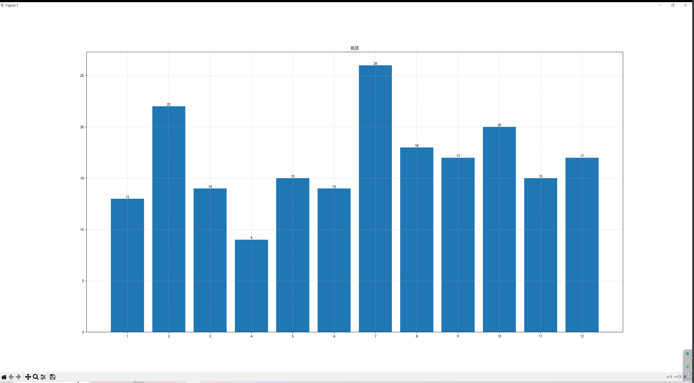

# 前言
前几天商场随机买了几注大乐透彩票花了20元（机选5注，自己手动选了5注），今天发现中了5块钱，好亏啊，想写一个程序程序帮我计算辅助一下哪些数字概率大一些


# 思路
获取最近100期的号码，统计一下每个数字在100期内的概率，看看是不是在100期内是不是真随机，各数字的概率差距有多大

提示：每期中一等奖的都是1/21425712的机会。中奖纪录会很小。

# 获取数据

大乐透官网：https://www.lottery.gov.cn/

选择最近一百期，打开F12,找到任意一期其中一个数字的xpath:`/html/body/div[4]/div[2]/div/div/div[1]/table/tbody/tr[1]/td[6]`

然后分析一下xpath,使用Chrome 插件：xpath-helper

尝试调整一下xpath ，让插件获取到最近100期的数据：  
xpath：`/html/body/div[4]/div[2]/div/div/div[1]/table/tbody/tr`

把途中`RESULTS (100)`的内容复制出来进行处理分析处理

# 处理
原数据内容为：
```
230330406101125070904061011250709
230340709101524041207091015240412
230350714232529021107142325290211
230360113222631021001132226310210
....
```
分别是 期号+中奖号码+中奖号码（有重复的中奖号码）
思路：  
* 1.以换行分割得到每一期的内容  
* 2.去掉每一期内容的期数，和重复的中奖号码
* 3.每隔两个数字分割，得出中奖的每一个数组
* 4.对数字进行统计次数（前区和后区独立开，因为会重复）

# 编码
```python3

import matplotlib.pyplot as plt  
from collections import Counter
from pylab import mpl


begin_all_list = []
end_all_list = []

# 读取文件
with open('./100.txt','r') as f:
    res = f.read()

    for i in res.split('\n'):
        one_data = i[5:-14]
        # print(i,one_data)
        begin,end = one_data[:10],one_data[10:] # 得到前区后区的字符串
        bengin_list = [begin[i:i+2] for i in range(0, len(begin), 2)] # 前区切割成数组
        end_list = [end[i:i+2] for i in range(0, len(end), 2)] # 后区切割成数组
        print(i,one_data,begin,end,bengin_list,end_list)
        begin_all_list += bengin_list # 搜集所有的前区号码
        end_all_list +=end_list # 收集所有后区号码

begin_ball = range(1,36) 
end_ball = range(1,13)

begin_ata_dict = {}
for i in begin_ball: # 遍历计算所有号码在前区号码的出现的次数
    counter = begin_all_list.count('%02d' % i)
    rate = round(counter/(5*100),0)
    begin_ata_dict[str(i)] = {
        "word":counter,
        "count":counter
        }


end_data_dict = {}
for i in end_ball: # 遍历计算所有号码在后区号码的出现的次数
    counter = end_all_list.count('%02d' % i)
    rate = round(counter/(2*100),2)
    end_data_dict[str(i)] = {
        "word":counter,
        "count":counter
        }
print(begin_ata_dict,end_data_dict)

mpl.rcParams["font.sans-serif"] = ["SimHei"]

# 设置正常显示符号
mpl.rcParams["axes.unicode_minus"] = False

count_list = [x['count'] for x in list(begin_ata_dict.values())]
plt.title("前区")
plt.grid(ls="--", alpha=0.5)
print(list(begin_ata_dict.values()), list(begin_ata_dict.values()))
plt.bar(list(begin_ata_dict.keys()), count_list) # 画图指定X，Y轴内容
for i in range(len(count_list)):
    word = list(begin_ata_dict.values())[i]['word']
    print('wrod',word,list(begin_ata_dict.keys())[i])
    plt.text(list(begin_ata_dict.keys())[i], word, word, va="bottom", ha="center") # 柱状图顶部文字

plt.show()

# 暂不能同时显示两张图片，取消注释后单独运行展示

# count_list = [x['count'] for x in list(end_data_dict.values())]
# plt.title("后区")
# plt.grid(ls="--", alpha=0.5)
# print(list(end_data_dict.values()), list(end_data_dict.values()))
# plt.bar(list(end_data_dict.keys()), count_list)
# for i in range(len(count_list)):
#     word = list(end_data_dict.values())[i]['word']
#     print('wrod',word,list(end_data_dict.keys())[i])
#     plt.text(list(end_data_dict.keys())[i], word, word, va="bottom", ha="center")

# plt.show()
```
统计前区后区的效果：



# 结论&简单分析
看起来毫无规律，前区出现次数最大差距 22-8=16次，按理来说买热门的数字应该概率大一些。

所以简单分析：

前区次数的众数是13次，出现13次的号码是09，12，21，29，31，34，35这几位数   
后区次数的众数是14次，出现14次的号码是03，06这几位数   
简单分析这几个数字是100期以内出现次数最多的数字，继续接着买应该纪律大一点吧  


