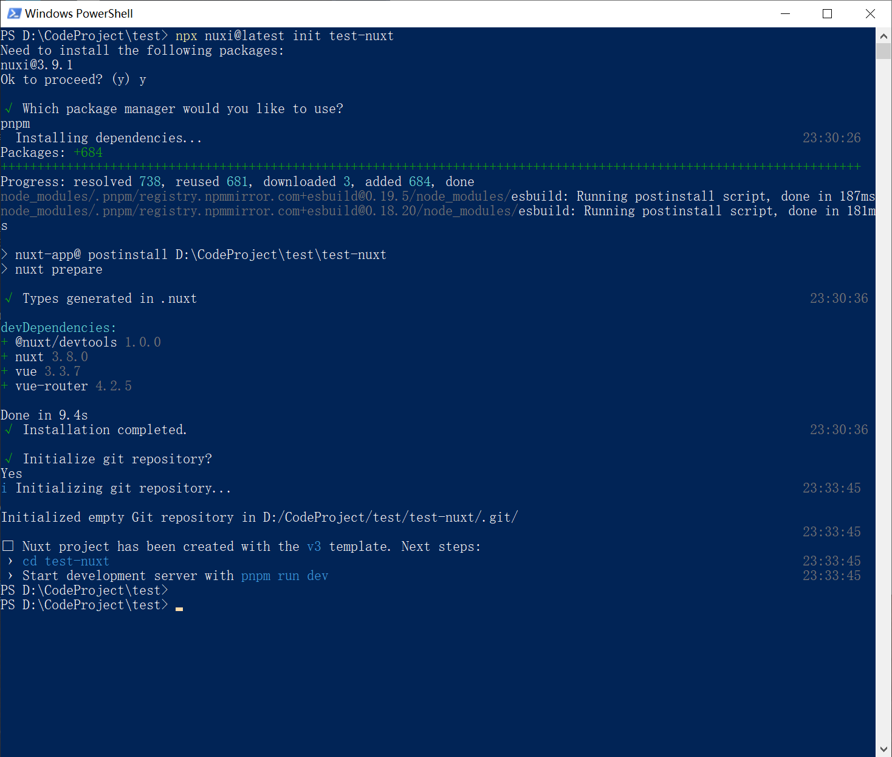
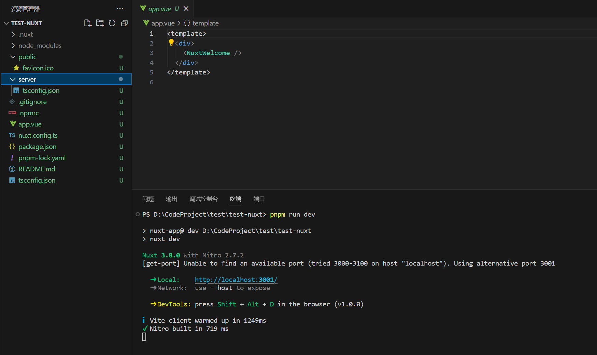
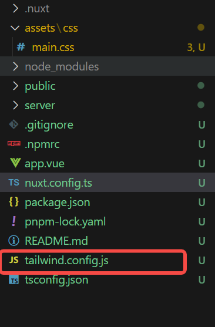
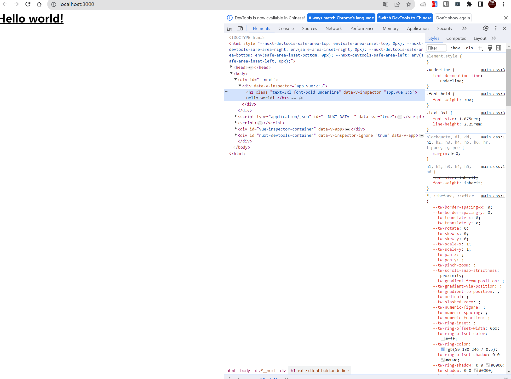
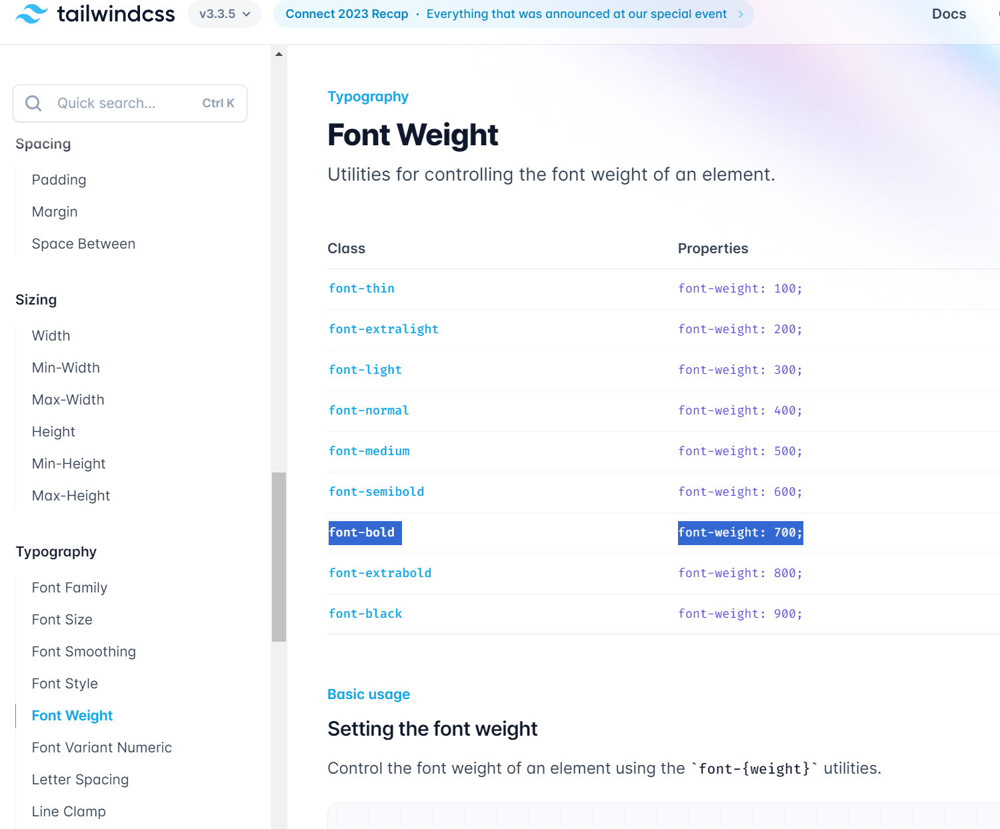
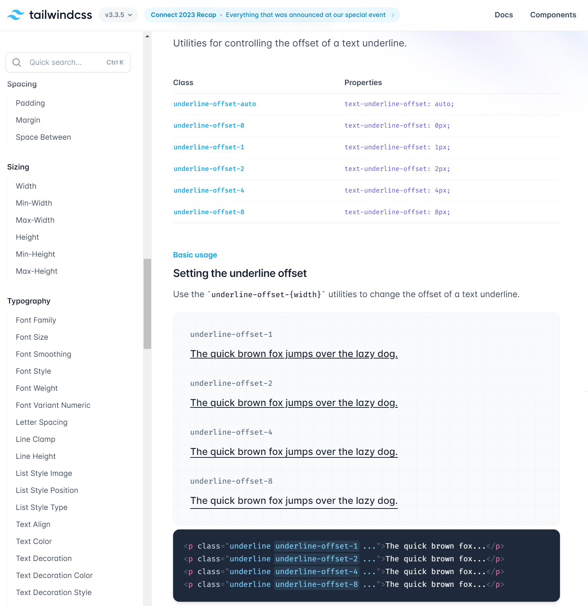

# 前言
想用nuxt3 这个框架学习一下Vu3 写个网站来展示自己的一些折腾的项目成功 ，了解一下tailwindcss

# 安装


# 安装tailwindCSS
安装教程：https://tailwindcss.com/docs/guides/nuxtjs
完整的跟官方一样：

安装命令（项目名称：test-nuxt）：
```bash
 npx nuxi@latest init test-nuxt

```
然后默认选择Y
Ok to proceed? (y) y

选择pnpm 为包管理器：


```html
https://tailwindcss.com/docs/guides/nuxtjs
```
然后cd 到项目目录 输入`pnpm run dev`启动,顺便看看项目目录

（有端口占用，默认的应该是3000，我这里是3001）




访问`127.0.0.1:3001` 看看效果
有一个过度好好看啊


看看效果：


# 安装tailwind
参考教程：https://tailwindcss.com/docs/guides/nuxtjs

做一下简单解析：

pnpm安装包：
```shell
 pnpm install -D tailwindcss postcss autoprefixer
```
初始化生成配置文件：
```shell
npx tailwindcss init
```
会自动生成`tailwind.config.js` 配置文件在根目录:



然后添加一段代码到nuxt的配置文件 `nuxt.config.ts` 中：
改之前：
```js
// https://nuxt.com/docs/api/configuration/nuxt-config
export default defineNuxtConfig({
  devtools: { enabled: true }
})

```
改之后
```js

export default defineNuxtConfig({
  devtools: { enabled: true },
  postcss: {
    plugins: {
      tailwindcss: {},
        autoprefixer: {},
    },
  },
})

```
postcss 是一个转换css 的工具，通过插件的形式增加,扩展css功能。这里告诉我们引入了两个插件`tailwindcss`,`autoprefixer`

`autoprefixer` 是一个自动为不同浏览器添加前缀的一个插件，提高编写代码的兼容性， 例如苹果的Safari 常常需要一个`-webkit-`的Css前缀确保CSS 能够正常工作

然后在自动生成的`tailwind.config.js`以下内容：
```js
/** @type {import('tailwindcss').Config} */
export default {
  content: [
    "./components/**/*.{js,vue,ts}",
    "./layouts/**/*.vue",
    "./pages/**/*.vue",
    "./plugins/**/*.{js,ts}",
    "./app.vue",
    "./error.vue",
  ],
  theme: {
    extend: {},
  },
  plugins: [],
}
```
`content` 是其中的一个选项，指定需要处理的 CSS 文件的路径


然后在项目根目录新建一个文件和对应的文件夹:`./assets/css/main.css` ,其内容为：
```css
@tailwind base;
@tailwind components;
@tailwind utilities;
```

这里指明了TailwindCSS 的基础样式，组件， 使用工具。目的是接下来把这个核心文件导入到项目中， 将来使用这些工具定义页面布局和样式

引入方法：
根目录下nuxt.config.js 里的CSS 配置项增加：`~/assets/css/main.css`：
```js
// https://nuxt.com/docs/api/configuration/nuxt-config
export default defineNuxtConfig({
  devtools: { enabled: true },
  css: ['~/assets/css/main.css'],
  postcss: {
    plugins: {
      tailwindcss: {},
      autoprefixer: {},
    },
  },
})

```

# 验证
修改根目录下的App.Vue，文件内容为：
```js
<template>
  <div>
    <h1 class="text-3xl font-bold underline">
      Hello world!
    </h1>
  </div>
</template>

```

运行`pmpn run dev` 访问`127.0.0.1:3000`查看:


定义了这个标签的三个CS 用法：
可以查询相关CSS简写的含义熟悉用法，最后孰能生巧了




tailwindCSS 多查查文档就会了~