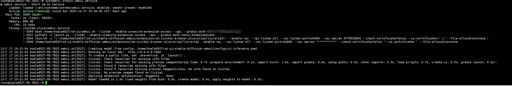
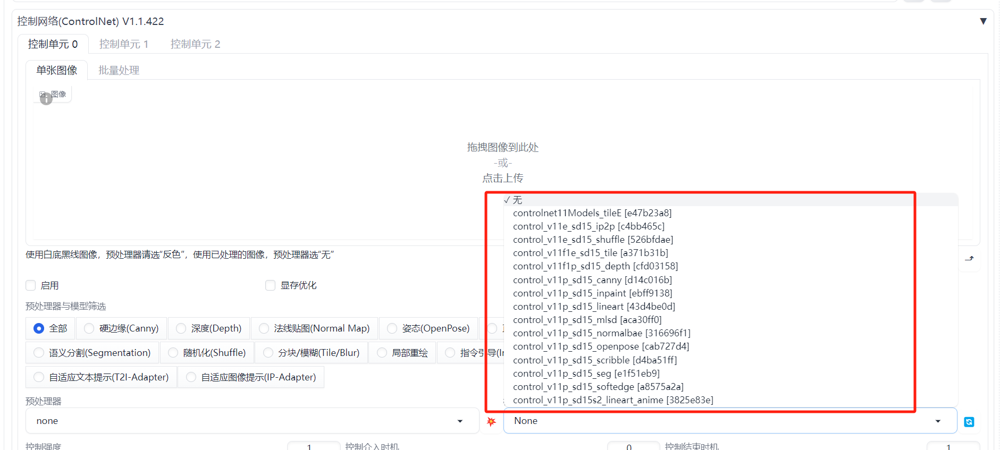

# 前言
前几天用Stable Diffusion到做一个文字图片融合的示例，今天就使用 Stable Diffusion API 批量操作制作，把视频拆成一帧一帧的图片，把这些图片融入到Stable Diffusion生成的图片里面去。

自己的Stable Diffusion 部署在Linux系统上，每次开机都需要手动切用户使用shell脚本，想做一个开机自动启动的脚本


# 开机脚本
使用linux systemd 服务管理工具，我的系统版本是Ubuntu22.04，需要新建服务管理脚本，文件位置：`/etc/systemd/system/webui.service`,内容如下：
```shell
[Unit]
Description=Start sd-ui service
After=multi-user.target

[Service]
User=koala9527
ExecStart=/home/koala9527/sd-ui/webui.sh --listen --enable-insecure-extension-access --api --gradio-auth root:123456

[Install]
WantedBy=default.target
```
1.注意使用正确的用户启动这个命令 ，我这里是`koala9527`   
2.还要注意正确的Stable Diffusion 的启动目录，我这里使用的绝对路径，从根目录开始写的  
3.注意我这里相对比上篇文章写的启动参数增加一个`--api`的选项，这里是启动API服务

使用一下命令使它重启自动启动并现在启动
```shell
systemctl daemon-reload
systemctl enable webui.service
systemctl start webui.service
```


# 下载controlnet
上篇只下载了controlnet 扩展，这次需要安装它的模型
模型地址：https://huggingface.co/lllyasviel/ControlNet-v1-1
需要使用Git下载移动到相关目录：/`*sd安装目录*`/extensions/sd-webui-controlnet/models

下载移动完成后效果：



# 参考源码
没有官方文档，自己找了一些案例测试测试了很多，最后是按照这个项目完成了想要的结果
ControlNet API项目地址：
https://github.com/Mikubill/sd-webui-controlnet


# API 
刚在脚本启动的时候增加了一个参数：`--api`，开放了相关的API 接口，现在访问Stable Diffusion 的地址加上`/api`:

```typescript
http://192.168.2.226:7860/docs
```
缺少图片展示API
 
找到接口：`sdapi/v1/txt2img`  
所以得到最终的请求接口：`http://192.168.2.226:7860/dapi/v1/txt2img`

根据上篇文章的图片融合的功能构造的请求参数：
```json

{
  "alwayson_scripts": {
    "controlnet": {
      "args": [
        {
          "enabled": true,
          "model": "control_v11f1e_sd15_tile [a371b31b]",
          "module": "tile_resample",
          "weight": 0.85,
          "image": "",
          "resize_mode": 0,
          "lowvram": true,
          "processor_res": 0,
          "threshold_a": 0,
          "threshold_b": 0,  
          "guidance_end": 0.75,
          "guidance_start": 0.25,    
          "pixel_perfect": false, 
          "control_mode": 0
      
        }
      ]
    }
  },
  "batch_size": 1,
  "cfg_scale": 7,
  "height": 512,
  "negative_prompt": "(worst quality, low quality:1.4),lowres,(Text:1.3),(logo:1.3), normal quality, cropped, blurry, drawing, painting,signature, soft, blurry, drawing, sketch, poor quality, ugly, type, word,pixelated, low resolution, saturated, high contrast, oversharpened",
  "override_settings": {
    "sd_model_checkpoint": "dreamshaper_8.safetensors [879db523c3]",
  },
  "clip_skip": 2,
  "prompt": "dvArchModern, 85mm, f1.8, portrait, photo realistic, hyperrealistic, orante, super detailed, intricate, dramatic, sunlight lighting, shadows, high dynamic range, house, masterpiece,best quality,(8k, RAW photo:1.2),(( ultra realistic)), modernvilla, blackandwhite, architecture, building, cloud, vivid colour, masterpiece,best quality,super detailed,realistic,photorealistic, 8k, sharp focus, a photo of a building",
  "restore_faces": false,
  "sampler_index": "DPM++ SDE Karras",
  "sampler_name": "",
  "script_args": [
  ],
  "seed": -1,
  "steps": 20,
  "tiling": false,
  "width": 512,
  "height":1024
}
```

# 封装功能Python函数

大概几个逻辑 需要转成代码  需要读取本地的转base64 转入接口，然后请求API 得到图片base64数据存到本地

整个Python 脚本：
```python
import requests
import io
import base64
from PIL import Image, PngImagePlugin
import glob

url = "http://192.168.2.226:7860/"
def getbase64(path):
    with open(path,'rb') as file:
        image_data = file.read()
    image_data = 'data:image/png;base64,'+base64.b64encode(image_data).decode('utf-8')
    return image_data

def build_img(name,image_data,save_path):

    payload={
  "alwayson_scripts": {
    "controlnet": {
      "args": [
        {
          "enabled": True,
          "model": "control_v11f1e_sd15_tile [a371b31b]",
          "module": "tile_resample",
          "weight": 0.85,
          "image": image_data,
          "resize_mode": 0,
          "lowvram": True,
          "processor_res": 0,
          "threshold_a": 0,
          "threshold_b": 0,  
          "guidance_end": 0.75,
          "guidance_start": 0.25,    
          "pixel_perfect": False, 
          "control_mode": 0
      
        }
      ]
    }
  },
  "batch_size": 1,
  "cfg_scale": 7,
  "height": 512,
  "negative_prompt": "(worst quality, low quality:1.4),lowres,(Text:1.3),(logo:1.3), normal quality, cropped, blurry, drawing, painting,signature, soft, blurry, drawing, sketch, poor quality, ugly, type, word,pixelated, low resolution, saturated, high contrast, oversharpened",
  "override_settings": {
    "sd_model_checkpoint": "dreamshaper_8.safetensors [879db523c3]",
  },
  "clip_skip": 2,
  "prompt": "dvArchModern, 85mm, f1.8, portrait, photo realistic, hyperrealistic, orante, super detailed, intricate, dramatic, sunlight lighting, shadows, high dynamic range, house, masterpiece,best quality,(8k, RAW photo:1.2),(( ultra realistic)), modernvilla, blackandwhite, architecture, building, cloud, vivid colour, masterpiece,best quality,super detailed,realistic,photorealistic, 8k, sharp focus, a photo of a building",
  "restore_faces": False,
  "sampler_index": "DPM++ SDE Karras",
  "sampler_name": "",
  "script_args": [
  ],
  "seed": -1,
  "steps": 20,
  "tiling": False,
  "width": 512,
  "height":1024
}

    response = requests.post(url=f'{url}sdapi/v1/txt2img', json=payload)

    r = response.json()
    res = r['images'][0]

    image = Image.open(io.BytesIO(base64.b64decode(res.split(",",1)[0])))

    png_payload = {
        "image": "data:image/png;base64," + res
    }
    response2 = requests.post(url=f'{url}sdapi/v1/png-info', json=png_payload)

    PI = PngImagePlugin.PngInfo()
    PI.add_text("parameters", response2.json().get("info"))
    image.save('./'+save_path+'/output_'+str(name)+'.png', pnginfo=PI)


# 定义要遍历的文件路径模式
file_pattern = "./cxk/*.png"
path = './cxk/'
# 遍历所有匹配指定模式的文件
count = 0
for filename in glob.glob(file_pattern):
      # print(filename)
      name= filename.split('\\')[-1]
      print(path+name)
      base64data = getbase64(path+name)
      save_path = 'cxk_build'
      build_img(name,base64data,save_path)
      print(count)  
    count+=1

```
在脚本目录下还有相关读取的文件夹，需要把融合的视频拆成一帧的文件夹为`cxk` ,通过融合过后保存的文件夹 需要提前新建:`cxk_build`

# 测试
最终效果就是生成了很多图片，我这里的视频是59秒，拆成一帧一帧的图片一共生成接近900张图片，使用的工具是ScreenToGIF，使用2070s生成一张15秒-16秒之间，粗略计算大概接近4个小时，非常耗电，哈哈 。


然后测试了几个发现去掉三分之一的帧数观感最好，保留所有的帧每一帧的展示时间多了看不清背景图，保留一般的图每一帧的展示时间少了看不清融入的图 
效果：


# 总结

其实使用 contolnet 脚本插件 LoopbackWave（ <https://github.com/FizzleDorf/Loopback-Wave-for-A1111-Webui）> 以及Deforum（<https://github.com/deforum-art/sd-webui-deforum）插件> 可以达到比上图更好的更丝滑的视频动态转场效果，但是看起来操作比较复杂，原因是自己作为程序员更希望通过发挥自己的技能来做出一些意思的东西。
后面也会继续折腾，分享教程\~