# 前言
最近在实践大模型本地部署，前几天在本地部署了一个ChatGLM大模型，刚好环境搭好了，也支持跑Stable Diffusion，所以就安装了再尝试一下。

原因是之前在B站上有大佬做了一个Windows电脑能一键运行的Stable Diffusion的安装包，自己也下载下来玩了一下，因为刚接触上手难度比较大，玩了一下放弃了。这两天随着SD XL 发布，看到能毫秒级地文字生成图片，还有cloudflare 有免费的服务提供，太震撼了，所以想动手做一些实际的东西出来分享一下。

对于没有接触过的同学通俗地来说Stable Diffusion 是一个开源的图像生产+调整工具，接下来我会从怎么安装Stable Diffusion到做一个文字图片融合的示例。


# 安装

首先是Stable Diffusion UI项目地址：https://github.com/AUTOMATIC1111/stable-diffusion-webui

我自己的环境是Linux环境，通过脚本安装的形式来启动网页工具，大多数人应该是Windows 环境，通过下载安装包的形式启动网页工具，这里不会介绍每个专业关键字的具体解释，但是会以新手角度顺便会说一下我遇到的问题   

根据项目介绍下载安装脚本，执行安装脚本：
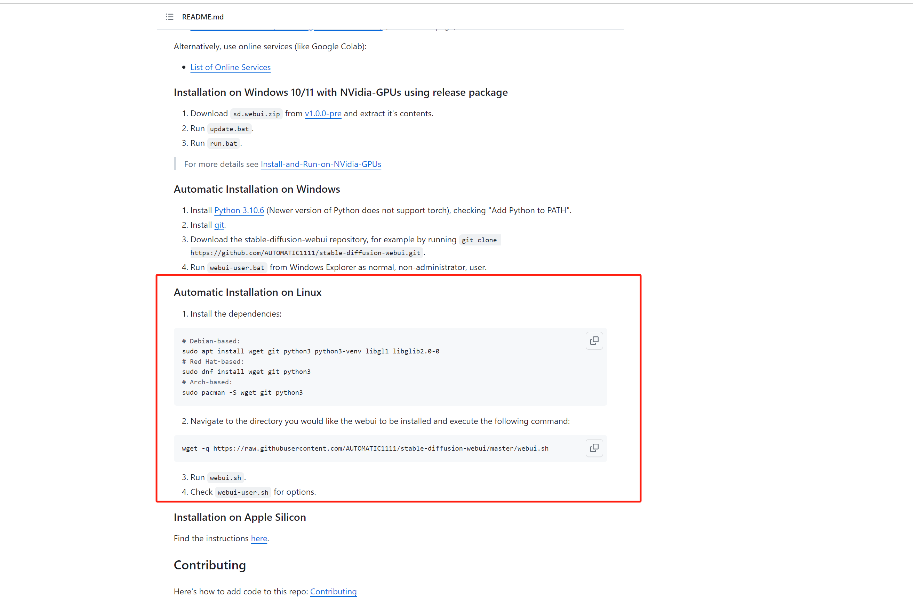

有些依赖软件我已经安装，这里我会根据官方提示下载一些相关依赖：
```shell
sudo apt install  libgl1 libglib2.0-0

wget -q https://raw.githubusercontent.com/AUTOMATIC1111/stable-diffusion-webui/master/webui.sh
sh webui.sh
```
执行安装脚本过后运行，开始的会报一个错，我是用root 权限执行的，会报错：
  

需要把这个webui.sh 执行权限改为非root 用户并以非root 用户运行 ，就是这样：

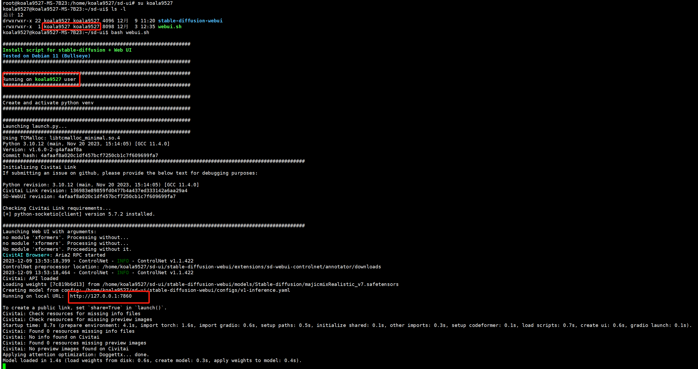
此时可以看起来没有问题了，实际上没有开放到内网机器访问，监听的是127.0.0.1 ，需要成0.0.0.0就需要给`webui.sh`加上参数才行，我还有一些其他的需求就是打开web ui的扩展权限和访问权限验证，就是下面这样：
```shell
bash webui.sh --listen --enable-insecure-extension-access --gradio-auth root:123456 
```
还可以增加其他参数达到相应其他的功能，可以去查找官方相关资料。  
效果：
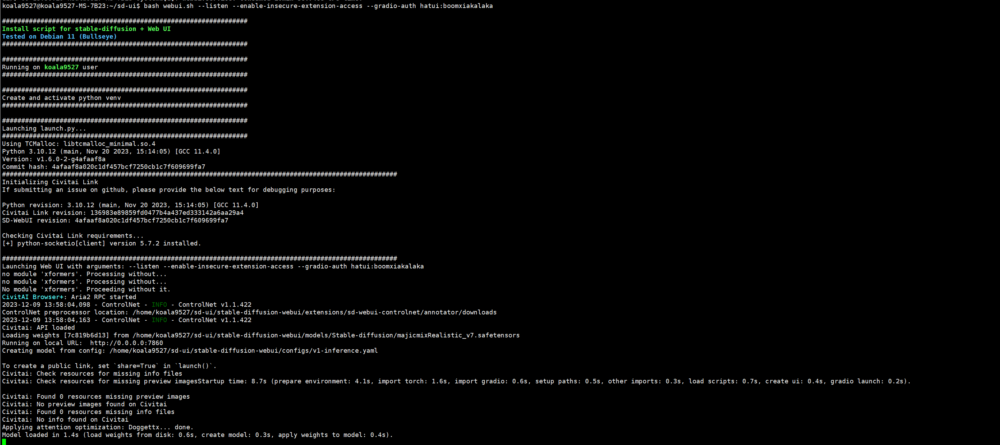
现在就可以通过内网机器访问这个机器部署的Stable Diffusion的服务了：  
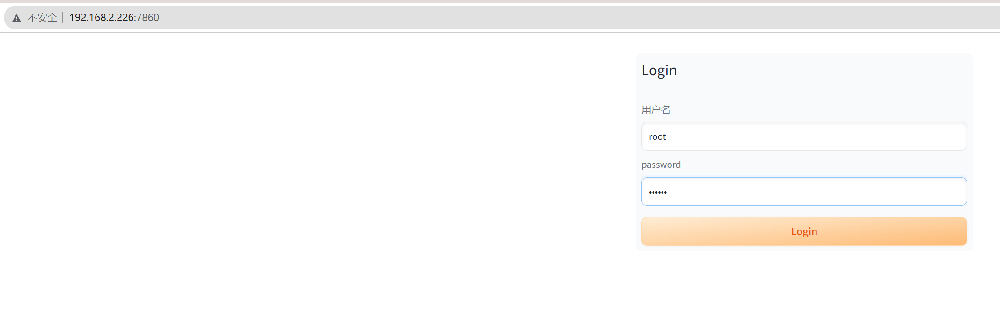
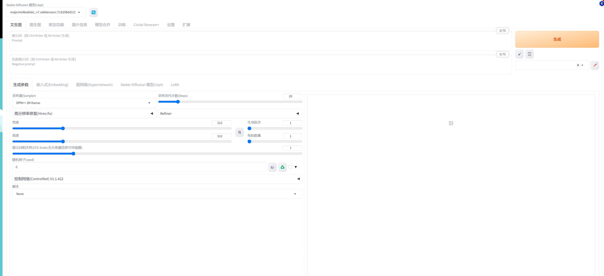
此时的webui截图是我安装一些插件的之后截图,接下来需要安装一些插件：  
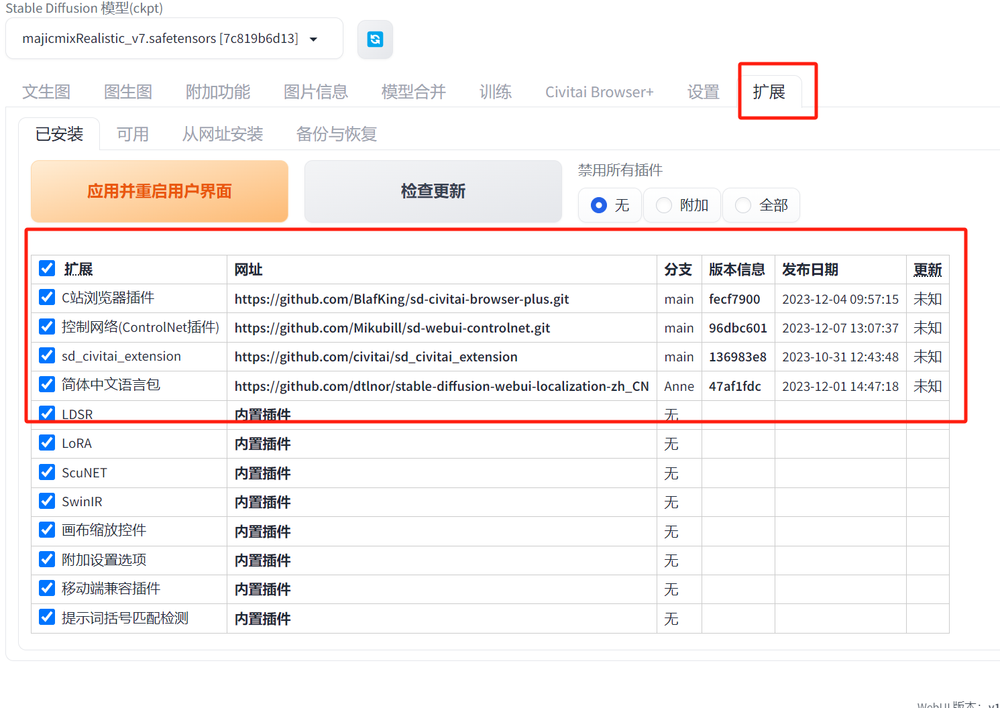

首先安装一个中文插件
扩展两种安装方式，第一种就是通过内置插件安装   
没安装搜这个`zh`  
安装过后就翻译搜不到了，搜`中文`：
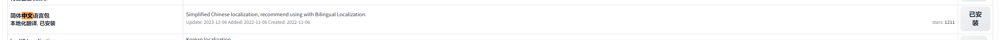
点击安装，这里应该也可以可以直接通过网址安装      
注意要在设置里面设置重启UI才能生效     
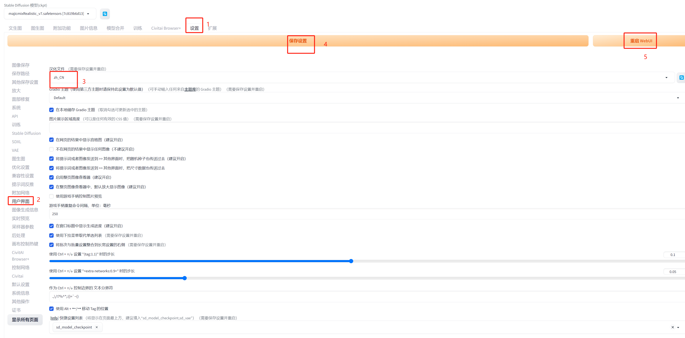

还需要装一个模型浏览工具 ：C站浏览器插件

点击安装就可以
第二种是通过网址安装：
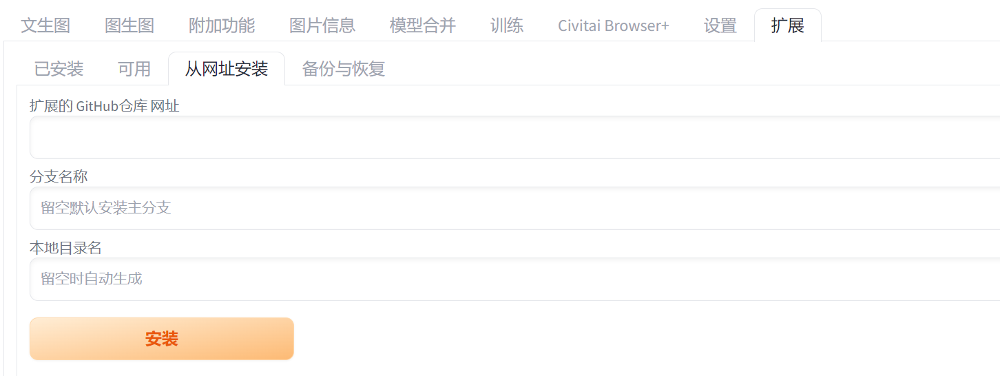

这里我通过这个网址安装了：    
1.控制网络(ControlNet插件)（https://github.com/Mikubill/sd-webui-controlnet.git）    
对图片进行精细化控制，以生成更具创意和控制力的图像 文字图片融合的核心插件    

2.sd_civitai_extension	（https://github.com/civitai/sd_civitai_extension）    
C 站的官方扩展，可以自动下载模型，获取模型信息，检查模型更新，自动下载缩略图的能力  

3.C站浏览器插件	（https://github.com/BlafKing/sd-civitai-browser-plus.git）   
C站就是著名的模型库完整完整网站，跟著名的Hugging Face一样的网站，但是C站有很多不可描述的东西，被墙了    

通过网址安装就用 git 项目地址点击安装就行了   


注意：所有的插件安装完成都需要在设置里面点击 ”保存设置“ 和 “重启WebUI”
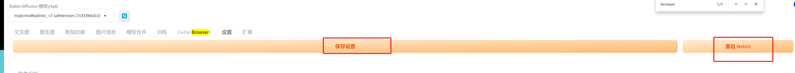

# 下载模型
使用`C站浏览器插件` 下载模型
这里推荐一个模型（下了很多模型还没来得及测试）：

`majicMIX realistic 麦橘写实` 


用于生成逼真的人物肖像底层模型

底层模型是模型生成图像所必需的，是模型的核心部分，可以相当于说基础数据集。   

直接完成就能自动进入左上角的`Stable Diffusion 模型(ckpt) `选项切换就行了  
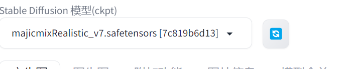

#  画图
这里我使用的是 majicmixRealistic 这个底层模型 生成一个人物

需要提示词prompt提示词，找了一些prompt社区里面的关键词   
正面提示：
```typescript
 jk_lure_dress3,8k,(realistic:1.1), (photorealistic:1.1), (masterpiece:1.1), (best quality:1.1), RAW photo, highres, ultra detailed, High detail RAW color photo,professional photograph,masterpiece, best quality,realistic,realskin,1girl,low_key,solo,lighting,long hair ,full body, standing,classroom, beautiful detailed eyes,natural lighting,, (detailed face:1.2),extremely beautiful face,
```
负面：
```typescript
white background, simple background, (ng_deepnegative_v1_75t), (badhandv4), (worst quality:2), (low quality:2), (normal quality:2), lowres, watermark, monochrome
```
我这里生成的人物素材是全身的，所以宽度我设置的是512，高度是1024，批次数量测试的时候就1个，几秒一个图，调好了话就一次多生成几个图，就选择每批次4-8个。 

随机种子-1 就是完全随机，想要生成的图片一致，把相关参数分享出去让别人生成一样的图片，这个随机种子参数就不能设置成-1。

Stable Diffusion有很多采样器类型，稍微查了一下资料，是指一种指用于生成图像的算法，对图像质量，速度，艺术风格有关，我这里使用DPM++ SDE Karras，


需要选中启用，显存小启用现存优化，然后开启预览，看下设置下面点击爆炸icon 预览是否正确

然后最重要的是控制网络这里，需要上传一个图片到控制单元0，注意白底黑字就要选择预处理器第一个`反色处理`，黑底白字就可以选择最后一个`仅重采样`，然后点击一下预处理器和模型中间 爆炸的图片 查看预览 是否图片有正常的字显示

这个图片可以自己在windows 电脑画图中画一个
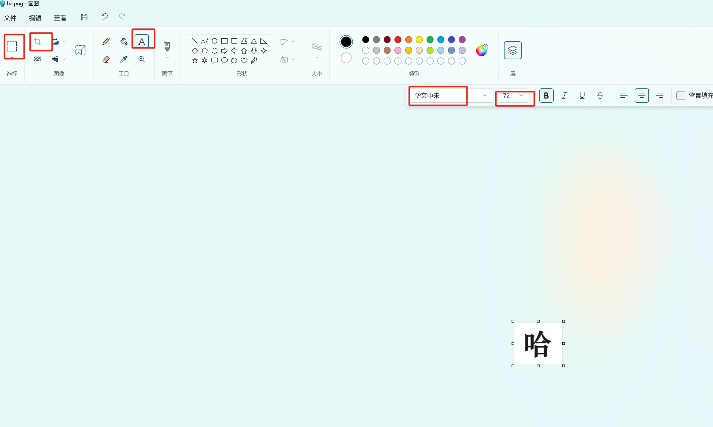
大概流程新建图片，插入文字，调整字体和大小，裁剪，保存，图片中字体位置 代表了融入图片的大概的位置，尽量居中，控制留白位置来控制在融入图片的位置，我这里是基本占满图片的设计

然后设置非常重要的三个参数 ，控制强度，控制介入开始时间和结束时间。这三个参数代表控制网络对图片影响   
 控制强度为 1.0 控制网络对生成图像的影响最大 ，字就最明显，控制强度为 0就不会有任何影响，所以这个参数应该在0.5到0.8之间，
开始时间和结束时间就是在控制强度正常的情况下对于随机图片元素的效果的影响。控制介入时机越晚，控制网络的影响就越晚开始，生成的图像就越随机，控制结束时机越晚，控制网络的影响就越晚结束，生成的图像就越随机，相反就反之。

这里大概三个参数分别差不多就在0.7，0.2，0.7这附近，可以根据自己的测试调整

这里测试了几个字，字的笔画复杂度 和粗细 和控制网络参数有一定关系，需要自己反复调整：


# 测试
除了字，还有网上特别火的图片背景融入的例子自己也测了一下，看看效果：

  
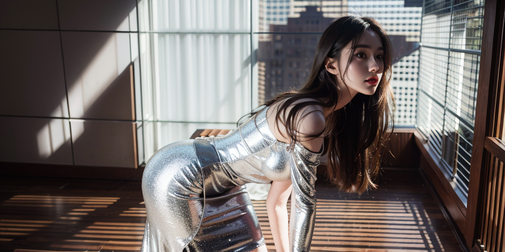  
效果还不错，生成的十张图片可以挑选出1到3张非常完美的图片出来，因为有一定几率会出现眼睛，手指有问题的现象，找到有几种解决方案还没来得及尝试。

Stable Diffusion 还有很多内容没有研究，实际上互联网上的真实有用案例教程还是很少的，需要自己去钻研，大模型时代的机遇和挑战已经来了。

接下来会研究其他风格图像生成，lora模型，和API 调用方向~