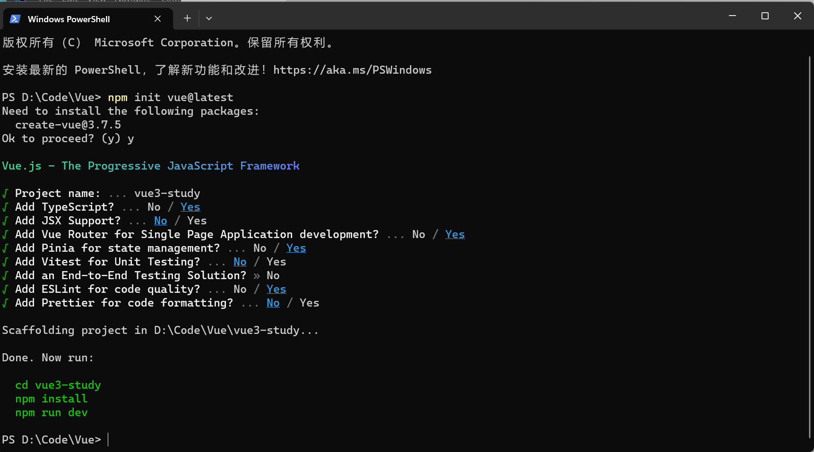

# 前言

Vue 3 工程化单页面应用（SPA）非常流行， 具有模块化开发、更快的渲染性能优点，今天就来学习一下Vue3工程化中路由相关的学习

## vue3路由使用
vue3 配套的路由版本是vue-route4.x

新建一个vue3 应用：
```shell
 npm init vue@latest
```
在新建项目的时候启用了vue-route



.png)

可以看到启用了vue-route这个组件


然后看到这个如何使用vue-route的相关代码:


在vue中有两种路由模式，一个是history 模式，一个是hash 模式代码示例中默认使用的是history模式，使用了`createWebHistory`关键字

其中使用`import.meta.env.BASE_URL`是读取环境变量文件（.env）中变量为BASE_URL的作用

使用路由模式在SPA应用里需要修改Nginx配置文件 ，把网站解析到打包过后的静态文件目录的根目录下的index.html文件，而Hash模式会将网站的URL 携带一个#符号的哈希片段，例如：`https://xxxx.com/#about`。这种模式兼容行比较好，但是URL 可读性比较差，两个特性不一样使用场景不同没有使用建议优先级之分，


### 实践配置路由数
```typescript
import type { RouteRecordRaw } from "vue-router";

const routes:Array<RouteRecordRaw>=[
{
    path:'/',
    name:'home',
    component:()=>import{'@viwes/home.vue'},
},
]
```
