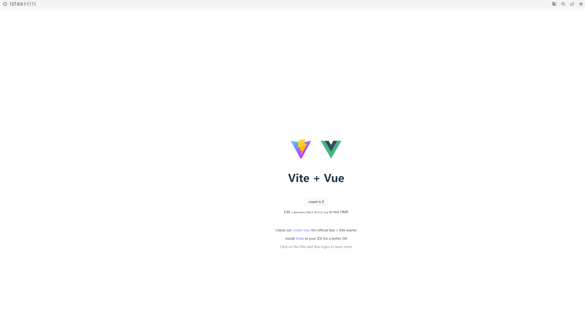
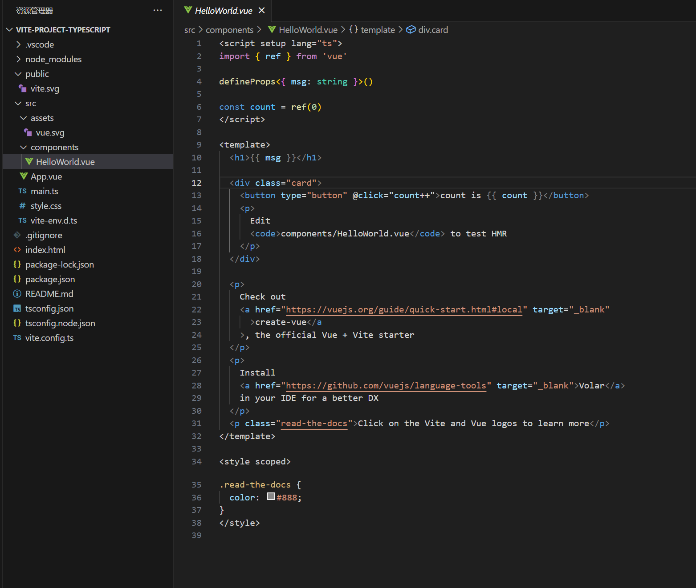

##  参考教程：


[VUE 官网](https://cn.vuejs.org/)  

[Vue3 入门指南与实战案例](https://vue3.chengpeiquan.com/)  

[BiliBili-尚硅谷Vue2.0+Vue3.0全套教程丨vuejs从入门到精通](https://www.bilibili.com/video/BV1Zy4y1K7SH/?vd_source=d81b0f1d86958760b70b7054b0ecfb07)  


## 前言
目的时学习UniApp ，需要前置学习一下Vue3,之前只了解了Vue2觉得落后太多了。很多概念不是很清楚，这里来基本整理一遍再开始实战

Vue的工程化，单一职责，高内聚，低耦合的特点

## 语法总结
首选创建一个官方推荐的脚手架：


使用 Vite 创建项目(主流)

```
npm create vite
```

```shell
PS D:\CodeProject\VueProject> npm create vite
Need to install the following packages:
  create-vite@4.4.1
Ok to proceed? (y) y
√ Project name: ... vite-project-typescript
√ Select a framework: » Vue
√ Select a variant: » TypeScript


```
设置项目名称：vite-project，vue类型项目，使用TypeScript 然后 cd 到vite-project-typescript, 安装依赖：
```typescript
npm install
```
启动项目：
```shell
npm run dev
```


访问http://127.0.0.1:5173/：



此时的目录结构：


有几个共识的文件统一目录：
* src： 源码
* src/main.ts: 入口文件
* src/view： 路由组件
* src/components：子组件目录
* src/route: 路由目录


# Composition API
Composition API 是Vue.js .30 新的编写组件的方式，旧的就是Option API

分别叫 组合式 API 和 选项式 API，组合就听着比较得复杂

### setup

组合式API 就必须使用setup 这个方法，当 Vue 组件创建时，setup 函数将作为组件的入口被调用。在 setup 函数中可以定义和返回在组件模板中需要的所有数据和方法。

```html
<template>
  <div>
    <label>
      <input type="radio" v-model="selectedOption" value="option1">
      Option 1
    </label>
    <label>
      <input type="radio" v-model="selectedOption" value="option2">
      Option 2
    </label>
    <p>You selected: {{ selectedOption }}</p>
  </div>
</template>

<script>
import { ref } from 'vue';

export default {
  name: 'SimpleOptionsComponent',
  setup() {
    const selectedOption = ref('option1');

    return {
      selectedOption
    };
  }
};
</script>
```

`export default` 是Vue2.js常见的导出组件的方式，但 Vue 3 建议使用命名导出来实现更灵活、清晰和强大的代码组织  
优化后：
```html
<template>
    <div>
      <label>
        <input type="radio" v-model="selectedOption" value="option1">
        Option 1
      </label>
      <label>
        <input type="radio" v-model="selectedOption" value="option2">
        Option 2
      </label>
      <p>You selected: {{ selectedOption }}</p>
    </div>
  </template>
  
  <script setup lang="ts">
  import { ref } from 'vue';
  
  const selectedOption = ref('option1');
  
  export { selectedOption };

  </script>
  
```
看起来有些简陋，还使用官方推荐的API 创建一个组件：
```html
<template>
  <div>
    <label>
      <input type="radio" v-model="selectedOption" value="option1">
      Option 1
    </label>
    <label>
      <input type="radio" v-model="selectedOption" value="option2">
      Option 2
    </label>
    <p>You selected: {{ selectedOption }}</p>
  </div>
</template>

<script>
import { defineComponent, ref } from 'vue';

export default defineComponent({
  setup() {
    const selectedOption = ref('option1');

    return {
      selectedOption
    };
  }
});
</script>

```
使用 defineComponent API 可以更清晰地表达组件的结构和选项，并且获得更好的类型推断和编辑器支持  
Vue3.js 所有的组合式API 每个生命走起函数都必须先导入才可以使用，并且所有的生命周期函数都需要放在setup中，后面会慢慢看到
Vue3.js的组件编程风格非常多官方还是推荐 `defineComponent` 这样定义一个组件 

### ref
其中`ref`是组合式API 中的一部分，`const selectedOption = ref('option1');`其中的 `selectedOption` 是一个可变的响应式的引用变量，这个组件被其他地方使用的时候，会让这个变量关联给其他地方使用达到响应式双向绑定的目的

`ref` 是一个响应式的API,可以用来定义所有类型的数据，包括Node节点和组件，上面个例子中使用ref创建了额一个响应式的数据对象，返回了一个可以最该数据变化的引用，在后面提供一种方式来修改`selectedOption`的值，也就是通过下面方式改变：
```javascript
selectedOption.value = 'option2';
// 或者

const { value } = selectedOption;
value = 'option2';
//或者
selectedOption.value.set('option2');
```
`ref`接受的是一个泛型的入参（<t>），上上个例子中使用了TS的自动推导，绑定了一个字符类型的参数，是一个最简单的绑定示例，ref 还可以绑定对象，数组，dom元素和子组件，功能强大，比较抽象，如果熟悉Vue2理解难度会小一些。

`ref`绑定dom 元素或子组件的时间必须在对应的js代码中使用red API 声明变量的名称，并且必须要return，入参类型名称也要定义好

最后注意使用`ref`声明的变量都会变成对象，任何Ref对象的值必须通过xxx.value 才能正确获取。

### reactive
这个　API 与ref非常相似，区别是reactive 只能绑定对象，数组，使用这个API好处就是对其绑定的数据进行操作非常人性化，可以直接操作

例子：
```html
<template>
    <div>
        <p>Count: {{ state.counter }}</p>
        <button @click="increment">Increment</button>
    </div>
</template>

<script lang="ts">
    import { defineComponent, reactive } from 'vue';

    interface State {
        counter: number;
    }

    export default defineComponent({
        setup() {
            // 创建一个响应式对象
            const state: State = reactive({
                counter: 0,
            });

            // 增加计数器的方法
            const increment = () => {
                state.counter++;
            };

            return {
                state,
                increment,
            };
        },
    });
</script>

```
注意使用这个API对数组操作重置的时候，不要强行改变数据的响应性
，不能直接赋值空数组而是使数组长度设置为0。

### toRef & toRefs

toRef 创建一个Ref对象，转换Reactive对象的某个关键字段为Ref变量  
toRefs 创建一个新的对象，把它的每一个字段都是Reactive对象各字段的Ref变量  

toRef 简单用法：
```typescript
const ages = reactive(['17','18','19'])
const a = toRef(ages,3)
console.log(a.value)
```

toRefs 简单用法：
```typescript
const names = reactive(['tom','andy','bob'])
const name = toRefs(names)
```

注意使用toRefs 转换后 使用解构赋值不会失去响应性，但是直接解构Reactive不会具有响应性
ES6解构示例：
```typescript
const {name1,name2,name3} = toRefs(names)
name1.value('mili')
```
### watch
示例:
```typescript
<template>
    <div>
        <p>Count: {{ count }}</p>
<button @click="increment">Increment</button>
    </div>
    </template>

    <script>
import { ref, watch } from 'vue';

export default {
    setup() {
        const count = ref(0);

        // 使用watch函数来观察count的变化
        watch(count, (newValue, oldValue) => {
            console.log('Count changed:', newValue, oldValue);
        });

        const increment = () => {
            count.value++;
        };

        return {
            count,
            increment
        };
    }
};
</script>

```
使用`watch`监听一个用`ref`定义的一个响应式变量

### watchEffect

watchEffect不需要显式地指定要观察的变量,用于自动追踪在回调函数中使用的所有响应式数据，并在任何一个数据发生变化时触发回调函数，示例：
```typescript
<template>
  <div>
    <p>Count: {{ count }}</p>
    <button @click="increment">Increment</button>
  </div>
</template>

<script>
import { ref, watchEffect } from 'vue';

export default {
  setup() {
    const count = ref(0);

    // 使用watchEffect函数来观察响应式数据的变化
    watchEffect(() => {
      console.log('Count changed:', count.value);
    });

    const increment = () => {
      count.value++;
    };

    return {
      count,
      increment
    };
  }
};
</script>

```
简化了watch的操作，但是监听不了响应式的变量变化前后的值

### computed
`computed`用于创建一个计算属性的API，它的值基于其他响应式数据计算出来的。

示例：
```typescript

<template>
  <div>
    <p>First Name: {{ firstName }}</p>
    <p>Last Name: {{ lastName }}</p>
    <p>Full Name: {{ fullName }}</p>
  </div>
</template>

<script>
import { ref, computed } from 'vue';

export default {
  setup() {
    const firstName = ref('John');
    const lastName = ref('Doe');

    // 使用computed函数创建计算属性fullName
    const fullName = computed(() => {
      return firstName.value + ' ' + lastName.value;
    });

    return {
      firstName,
      lastName,
      fullName
    };
  }
};
</script>

```

这个计算属性也可以通过调用特定的函数方法来计算，使用这个API主要是为了更好的性能，避免重复计算，这个API 会有缓存的设计。

## 指令
VUE中非常常见的一些语法糖，用于简化原生HTML的写法
### 内置指令
* v-model：用于在表单元素和组件之间创建双向数据绑定。它可以简化表单元素的值和Vue实例中的数据之间的同步。

* v-if：根据表达式的值来条件性地渲染元素。如果表达式的值为真，则元素会被渲染；如果为假，则元素会被移除。

* v-show：根据表达式的值来切换元素的显示和隐藏。如果表达式的值为真，则元素会显示；如果为假，则元素会隐藏，但仍然占据DOM空间。

* v-for：用于循环渲染列表中的元素。它可以遍历数组或对象，并为每个元素生成对应的DOM节点或组件实例。

* v-bind（简写为:）：用于动态地绑定属性或组件的属性。可以将表达式的值绑定到元素的属性或组件的属性上。

* v-on（简写为@）：用于监听DOM事件或组件自定义事件，并在事件触发时执行相应的方法。

* v-text：用于将表达式的值作为元素的文本内容进行渲染。

* v-html：用于将表达式的值作为HTML内容进行渲染。
如果熟悉VUE3 就会很简单上手啦
### 钩子函数
生命周期钩子函数，在官网的选项式API介绍中有12个钩子函数，这里介绍一下比较常见的几个钩子函数：
* beforeCreate：当指令第一次绑定到元素并却在挂载父组件之前调用，无法访问组件的数据，方法和DOM元素

* created：在组件实例被创建后立即调用。在这个钩子函数中，组件实例已经创建完成，可以访问到组件的数据、方法和DOM元素。

* beforeMount：在组件挂载到DOM之前调用。在这个钩子函数中，组件的模板已经编译完成，但尚未插入到DOM中。

* mounted：在组件挂载到DOM后调用。在这个钩子函数中，组件已经被插入到DOM中，可以访问到组件的DOM元素。

* beforeUpdate：在组件更新之前调用。在这个钩子函数中，组件的数据发生变化，但DOM尚未更新。

* updated：在组件更新之后调用。在这个钩子函数中，组件的数据已经更新，DOM也已经更新完成。

* beforeUnmount：在组件卸载之前调用。在这个钩子函数中，组件尚未从DOM中移除。

* unmounted：在组件卸载之后调用。在这个钩子函数中，组件已经从DOM中移除。

```javascript
import { onMounted } from 'vue';

export default {
    setup() {
        onMounted(() => {
            // 在组件挂载到 DOM 后执行的逻辑
            console.log('组件已挂载到 DOM');
        });
    }
};

```


### 插槽
插槽（slot）就是在使用子组件的时候，在<template />中使用类似html标签，在子组件里传入任意模板代码以及HTML代码  
使用示例：
```html
<!-- ParentComponent.vue -->
<template>
    <div>
        <h1>父组件</h1>
        <slot></slot>
    </div>
</template>

<script>
    export default {
        name: 'ParentComponent',
    };
</script>

```
```html
<!-- App.vue -->
<template>
    <div>
        <ParentComponent>
            <h2>子组件插槽内容</h2>
            <p>这是子组件插槽的默认内容</p>
        </ParentComponent>
    </div>
</template>

<script>
    import { defineComponent } from 'vue';
    import ParentComponent from './ParentComponent.vue';

    export default defineComponent({
        name: 'App',
        components: {
            ParentComponent,
        },
    });
</script>

```
以上的代码是一个叫匿名插槽的使用方法，还有叫`具名插槽`的使用方法   
具名插槽：
```html
<!-- ParentComponent.vue -->
<template>
    <div>
        <h1>父组件</h1>
        <slot name="content"></slot>
    </div>
</template>

<script>
    import { defineComponent } from 'vue';

    export default defineComponent({
        name: 'ParentComponent',
    });
</script>


```
```html
<!-- App.vue -->
<template>
    <div>
        <ParentComponent>
            <template v-slot:content>
                <p>子组件的插槽内容</p>
            </template>
        </ParentComponent>
    </div>
</template>

<script>
    import { defineComponent } from 'vue';
    import ParentComponent from './ParentComponent.vue';

    export default defineComponent({
        name: 'App',
        components: {
            ParentComponent,
        },
    });
</script>
```

当父组件没有传入插槽内容时，会使用默认的内容来显示，默认插槽和具名插槽都支持这个功能

## CSS处理


### 动态绑定
使用变量来绑定class名称，使用`:class`来动态修改元素的class，示例：
```html
<template>
    <div :class="{ active: isActive, 'text-bold': isBold }">
        Dynamic Class Example
    </div>
</template>

<script>
    import { ref } from 'vue';

    export default {
        setup() {
            const isActive = ref(true);
            const isBold = ref(false);

            return {
                isActive,
                isBold,
            };
        },
    };
</script>


```
也可以传入一个数组绑定多个class：
```html
<template>
    <div :class="[isActive ? 'active' : '', isBold ? 'text-bold' : '']">
        Dynamic Class Example
    </div>
</template>

<script>
    import { reactive } from 'vue';

    export default {
        setup() {
            const state = reactive({
                isActive: true,
                isBold: false,
            });

            return {
                ...state,
            };
        },
    };
</script>

```

还可以使用`:style`动态修改内联样式：
```html
<template>
  <div :style="customStyle">
    Inline Style Example
  </div>
</template>

<script>
import { reactive } from 'vue';

export default {
  setup() {
    const customStyle = reactive({
      color: 'red',
      fontSize: '20px',
      backgroundColor: 'lightblue',
    });

    return {
      customStyle,
    };
  },
};
</script>

```
使用v-bind 动态修改style:
```html
html
<template>
  <div>
    <button @click="changeColor">改变颜色</button>
    <p :style="dynamicStyle">这是一个示例文本</p>
  </div>
</template>

<script>
import { ref } from 'vue';

export default {
  setup() {
    // 创建响应式的数据
    const dynamicStyle = ref({
      color: 'red',
      fontSize: '16px'
    });

    // 改变颜色的方法
    const changeColor = () => {
      dynamicStyle.value.color = 'blue';
    };

    return {
      dynamicStyle,
      changeColor
    };
  }
};
</script>
```

这个是vue3.2.0以后的新功能，此时的CSS响应式属性的更改不会触发模板的重新渲染。

### CSS 作用域
CSS 作用域是全局的，为了避免污染其他组件，Vue 在style 标签加上关键字`scoped`避免这个问题，编译过后都会带有一个`data-v-xxxx`的属性，是一个随机的Hash值，同一个组件的Hash是相同并且是唯一的
带有此关键字的元素生成的样式权重是高于全局CSS的
示例：
```html
<template>
  <div>
    <p class="global-style">这是全局样式</p>
    <p class="scoped-style">这是局部样式</p>
  </div>
</template>

<style scoped>
/* 全局样式 */
.global-style {
  color: blue;
}

/* 局部样式 */
.scoped-style {
  color: red;
}
</style>

```

#### Style Module
Vue3 新推出的方案，通过给DOM元素添加自定义属性的方式避免冲突，比较激进，示例：
```html
<template>
    <p :class="classes.msg">hello</p>
</template>

<style module="classes">
    .msg {
        color: #00ff00;
    }
</style>

```
编译以后会成为一个hash值的类型绑定在DOM元素上，会渲染一个绿色的hello   
使用`style`标签作为一个变量，module 给变量一个名称，绑定到DOM 中渲染。

#### useCssModule
Vue3的一个全新的API，使用JavaScript操作CSS Module.
示例：
```html
<template>
    <p :class="$style.msg">
        <span :class="$style.text">hello</span>
    </p>
</template>

<script lang="ts">
    import {defineComponent, useCssModule} from 'vue'
    export default defineComponent({
    setup(){
        const style = useCssModule()
        console.log(style)
    },
})

</script>

<style module>
    .msg{
        color: #00ff00;
    }
    .text{
        font-size: 14px;
    }
</style>
```
将style标签内容作为一个变量$style,与DOM标签的class 绑定

### CSS 预处理器
CSS 预处理器是一个扩展CSS 语言的工具，给CSS提供了一些额外的功能和特性，使CSS 更易于编写，组织和维护。常见的有less,sass,Stylus
Vite 已经内置了对预处理文件的支持，以less 为例：
```html
<template>
    <p :class="$style.msg">
        <span :class="$style.text">hello</span>
    </p>
</template>

<script lang="ts">
    import {defineComponent, useCssModule} from 'vue'
    export default defineComponent({
    setup(){
        const style = useCssModule()
        console.log(style)
    },
})

</script>

<style lang="less" scoped>
    @color-black:#333333;
    @color-red:#ff0000;

    .msg{
        color: @color-black;
    }
    .text{
        color:@color-red
    }
</style>
```
在less 预处理其中可以在style 标签中使用定义CSS颜色为一个变量，在其他地方使用，代码复用的思想。  
style 标签中scoped 的作用表示 该style 标签的作用域只在当前组件的DOM元素中。起到了一定的隔离作用，更符合组件化的规范。

v


