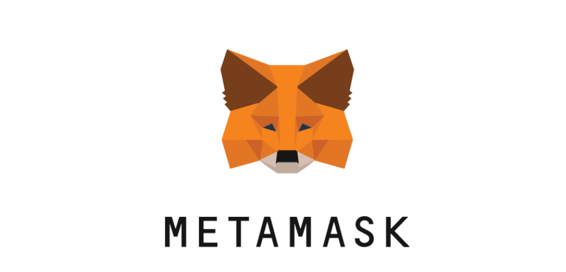
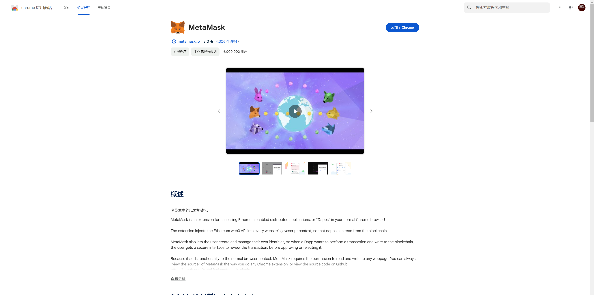
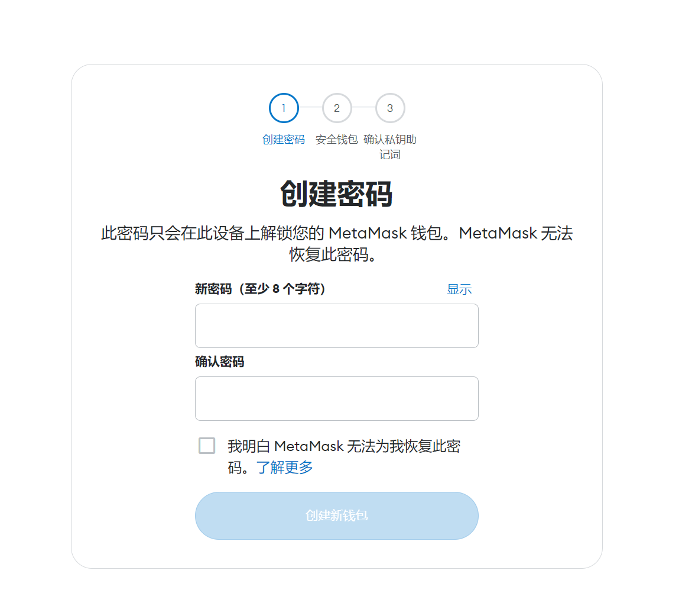
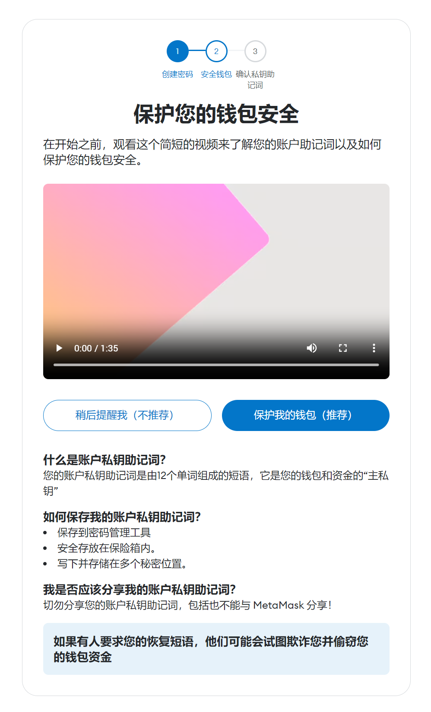
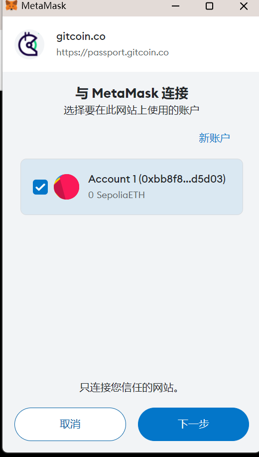
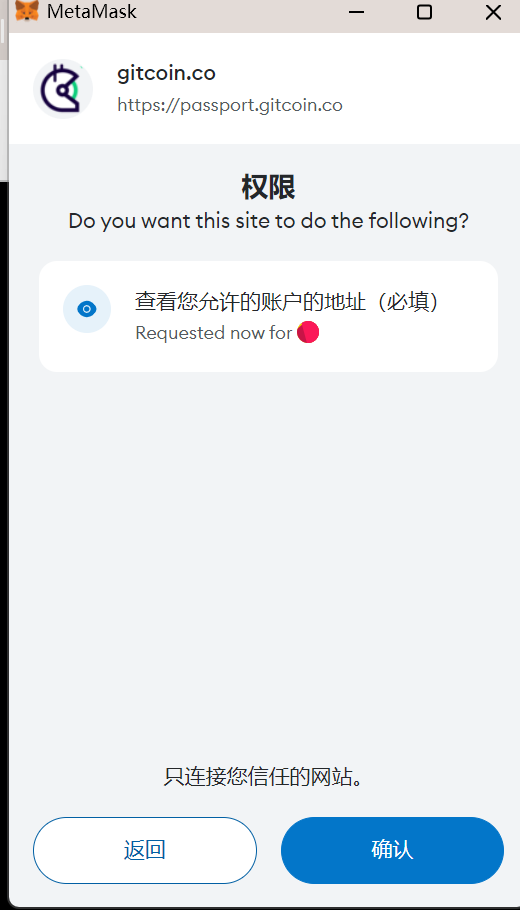
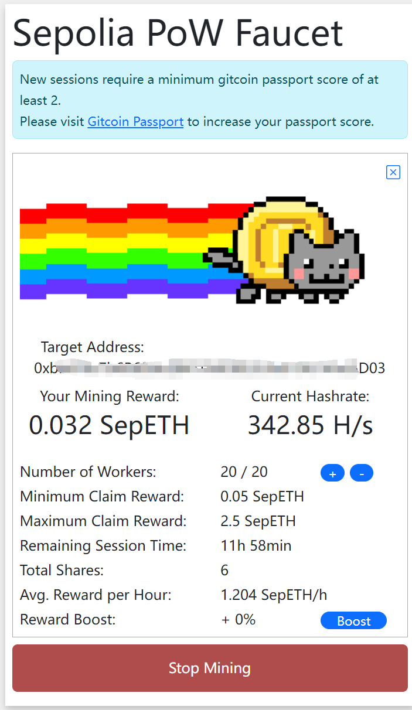

# 前言
本系列教程会 从新手角度 学习web3，从以太坊合约，了解基本区块链知识
第一步骤就是使用meta-mask钱包，在测试网测试 新建以太坊钱包

# 介绍mate-mask钱包

meta-mask 就是web3 最流行的钱包，本教程只介绍在浏览器上面安装meta-mask钱包。
meta-mask 钱包安装之前介绍一下基本知识。

MetaMask 是一款流行的加密货币钱包，可让您存储、管理和使用以太坊和其他区块链上的数字资产。它就像一个数字银行账户，用于存储您的加密货币和与区块链应用程序（dApps）交互。

MetaMask 的优势：

易于使用：MetaMask 拥有简单的界面，即使是初学者也可以轻松使用。
安全：MetaMask 使用多种安全功能来保护您的加密货币，例如密钥管理和存储。
功能丰富：MetaMask 支持各种功能，包括代币交换、NFT 管理等。
开源：MetaMask 是开源软件，这意味着其代码经过公开审查并可供任何人检查。
MetaMask 的局限性：

仅支持以太坊和其他兼容区块链：MetaMask 目前仅支持以太坊和其他基于 EVM 的区块链。
存在安全风险：与任何加密钱包一样，MetaMask 存在安全风险，例如黑客攻击和用户错误。

（指与以太坊虚拟机（EVM）兼容的区块链。EVM 是以太坊区块链的核心组件，用于执行智能合约。智能合约是存储在区块链上的代码，可用于执行各种操作，例如转账、创建代币和管理数据。）

# 安装meta-mask钱包
在谷歌浏览器商店或者在meta-mask 官网也可以找到安装 入口

点击安装就会出现在谷歌浏览器右上角   

自动会创建一个网页标签提示初始化

接下跟随提示创建钱包，前提是创建一个密码，这个密码只会在此设备上解锁您的 MetaMask 钱包，非常重要，在web3中安全是至关重要的一环，需要增加一些复杂度，尽量不要和其他地方的密码一致

它通常由 12 到 24 个单词组成，这些单词是从预定义的单词列表（例如 BIP-39 词汇表）中选取的。单词的数量决定了助记词的熵值或安全强度。单词越多，熵值越高，安全性越好。

作用就是提供了一种备份机制，以防您丢失设备或忘记密码，也可以通过助记词轻松地将钱包传输到新设备
如果了解RSA 加解密的密钥方式，可以理解成一个密钥对的私钥，公钥就是钱包的地址。

# 讲解meta-mask钱包

安装完成后会直接连接以太坊区块链

刚创建的钱包当然是没有任何ETH,此时就要链接测试网，去领取一些测试用的虚拟币。

点击左上角的选择网络，继续点击“显示测试网络“，点击Sepolia

Sepolia是以太坊的 PoS（权益证明）测试网。这是一个允许开发者测试和部署去中心化应用程序（dApp）的公共区块链网络，然后再将其发布到主以太坊网络上。

而且它是免费的测试网，因此开发人员可以随意尝试它，而无需担心任何费用。

怎么领取测试用的ETH呢？

为了防止滥用，多数会有条件限制，要求主网络地址内存有0.001ETH或在浏览器端挖矿来换取等等

接下来在Sepolia 官网：https://sepolia-faucet.pk910.de/  
把刚刚创建钱包的地址复制到官网中领取测试的ETH

此时会提示钱包 不符合最低护照分数，此时提示可以使用Gitcoin Passport验证您的唯一身份并提高您的分数。

点击链接钱包

链接钱包登录成功过后就提示可以提升自己的护照分数了，点击继续，此时提示有90天的有效期，随时可以重新认证  

此时可以验证自己的真实的虚拟币资产或者其他账号信息，这里我链接了我的gitHub 来提升自己的护照分数，这些分数再用来挖矿获取测试网的ETH

此时刷新 Sepolia 官网 再次验证 自己的公钥地址，就是在提示挖矿了，提示在每小时1.2个ETH的速度在挖矿，达到一定的数目可以定时挖矿并且索取奖励就是提现到自己的钱包中

